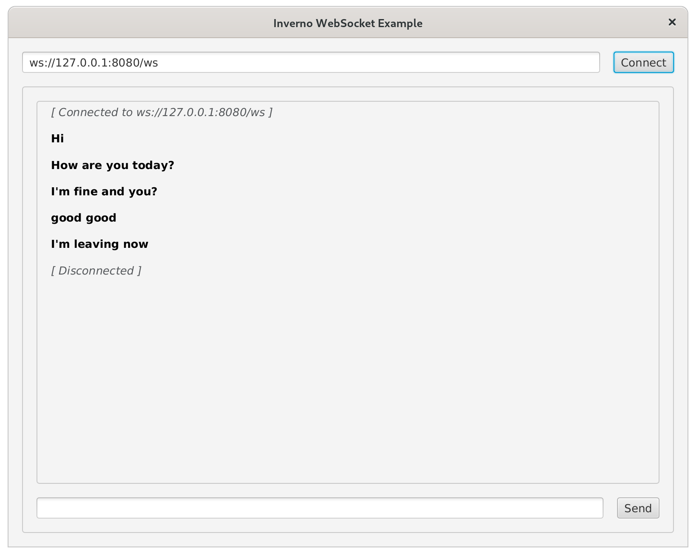

[inverno-mod-http-client]: https://github.com/inverno-io/inverno-mods/blob/master/inverno-http-client/
[inverno-core-root-doc]: https://github.com/inverno-io/inverno-core/blob/master/doc/reference-guide.md
[inverno-javadoc]: https://inverno.io/docs/release/api/index.html
[inverno-example-http-websocket]: https://github.com/inverno-io/inverno-examples/blob/master/inverno-example-http-websocket/

[epoll]: https://en.wikipedia.org/wiki/Epoll
[javafx]: https://openjfx.io/

# Inverno HTTP client WebSocket example

A sample application showing how to use the HTTP client module to create efficient and performant WebSocket clients.

The application presents a [JavaFX][javafx] UI similar to the WebSocket Web client provided in the [WebSocket server example][inverno-example-http-websocket] application. It allows to connect to a WebSocket server and send and receive text messages. Apart from demonstrating the WebSocket client, this application also show how easy it is to integrate external libraries like JavaFX. 

The client is configured to use [epoll][epoll] when available (ie. on Linux platform) for better performance.

The Maven build descriptor also defines a `release` profile which builds a native application image in a `zip` archive.

## Running the application

The application is a simple chat application that connects to the [WebSocket server example][inverno-example-http-websocket] application which should be started first.

```plaintext
$ mvn inverno:run
2023-12-22 16:28:54,226 INFO  [main] i.i.c.v.Application - Inverno is starting...


     ╔════════════════════════════════════════════════════════════════════════════════════════════╗
     ║                      , ~~ ,                                                                ║
     ║                  , '   /\   ' ,                                                            ║
     ║                 , __   \/   __ ,      _                                                    ║
     ║                ,  \_\_\/\/_/_/  ,    | |  ___  _    _  ___   __  ___   ___                 ║
     ║                ,    _\_\/_/_    ,    | | / _ \\ \  / // _ \ / _|/ _ \ / _ \                ║
     ║                ,   __\_/\_\__   ,    | || | | |\ \/ /|  __/| | | | | | |_| |               ║
     ║                 , /_/ /\/\ \_\ ,     |_||_| |_| \__/  \___||_| |_| |_|\___/                ║
     ║                  ,     /\     ,                                                            ║
     ║                    ,   \/   ,                                  -- ${VERSION_INVERNO_CORE} --                 ║
     ║                      ' -- '                                                                ║
     ╠════════════════════════════════════════════════════════════════════════════════════════════╣
     ║ Java runtime        : OpenJDK Runtime Environment                                          ║
     ║ Java version        : 21.0.1+12-29                                                         ║
     ║ Java home           : /home/jkuhn/Devel/jdk/jdk-21.0.1                                     ║
     ║                                                                                            ║
     ║ Application module  : io.inverno.example.app_http_websocket_client                         ║
     ║ Application version : 1.0.0-SNAPSHOT                                                       ║
     ║ Application class   : io.inverno.example.app_http_websocket_client.Main                    ║
     ║                                                                                            ║
     ║ Modules             :                                                                      ║
     ║  * ...                                                                                     ║
     ╚════════════════════════════════════════════════════════════════════════════════════════════╝


2023-12-22 16:28:54,235 INFO  [main] i.i.e.a.App_http_websocket_client - Starting Module io.inverno.example.app_http_websocket_client...
2023-12-22 16:28:54,236 INFO  [main] i.i.m.b.Boot - Starting Module io.inverno.mod.boot...
2023-12-22 16:28:54,492 INFO  [main] i.i.m.b.Boot - Module io.inverno.mod.boot started in 255ms
2023-12-22 16:28:54,492 INFO  [main] i.i.m.h.c.Client - Starting Module io.inverno.mod.http.client...
2023-12-22 16:28:54,492 INFO  [main] i.i.m.h.b.Base - Starting Module io.inverno.mod.http.base...
2023-12-22 16:28:54,497 INFO  [main] i.i.m.h.b.Base - Module io.inverno.mod.http.base started in 4ms
2023-12-22 16:28:54,503 INFO  [main] i.i.m.h.c.Client - Module io.inverno.mod.http.client started in 10ms
2023-12-22 16:28:54,759 INFO  [main] i.i.e.a.App_http_websocket_client - Module io.inverno.example.app_http_websocket_client started in 530ms
2023-12-22 16:28:54,759 INFO  [main] i.i.c.v.Application - Application io.inverno.example.app_http_websocket_client started in 588ms
```

You should now be able to use the JavaFX UI to connect to the WebSocket server, send and receive messages



## Packaging the application

The application can be packaged as a native runtime image by invoking the `release` build profile:

```plaintext
$ mvn install -Prelease
...
[INFO] --- inverno:${VERSION_INVERNO_TOOLS}:package-app (inverno-package-app) @ inverno-example-http-websocket-client ---
 [═══════════════════════════════════════════════ 100 % ══════════════════════════════════════════════] 
[INFO] 
[INFO] --- maven-install-plugin:2.5.2:install (default-install) @ inverno-example-http-websocket-client ---
[INFO] Installing /home/jkuhn/Devel/git/frmk/inverno/inverno-examples/inverno-example-http-websocket-client/target/inverno-example-http-websocket-client-1.0.0-SNAPSHOT.jar to /home/jkuhn/.m2/repository/io/inverno/example/inverno-example-http-websocket-client/1.0.0-SNAPSHOT/inverno-example-http-websocket-client-1.0.0-SNAPSHOT.jar
[INFO] Installing /home/jkuhn/Devel/git/frmk/inverno/inverno-examples/inverno-example-http-websocket-client/pom.xml to /home/jkuhn/.m2/repository/io/inverno/example/inverno-example-http-websocket-client/1.0.0-SNAPSHOT/inverno-example-http-websocket-client-1.0.0-SNAPSHOT.pom
[INFO] Installing /home/jkuhn/Devel/git/frmk/inverno/inverno-examples/inverno-example-http-websocket-client/target/inverno-example-http-websocket-client-1.0.0-SNAPSHOT-application_linux_amd64.zip to /home/jkuhn/.m2/repository/io/inverno/example/inverno-example-http-websocket-client/1.0.0-SNAPSHOT/inverno-example-http-websocket-client-1.0.0-SNAPSHOT-application_linux_amd64.zip
[INFO] ------------------------------------------------------------------------
[INFO] BUILD SUCCESS
[INFO] ------------------------------------------------------------------------
```

The previous command creates folder `target/inverno-example-http-websocket-client-1.0.0-SNAPSHOT-application_linux_amd64` containing the Java runtime and the application and installed the corresponding archive to the Maven repository:

```plaintext
$ ./target/inverno-example-http-websocket-client-1.0.0-SNAPSHOT-application_linux_amd64/bin/example-http-websocket-client
...
```

## Going further

- [HTTP client module documentation][inverno-mod-http-client]
- [Inverno core documentation][inverno-core-root-doc]
- [API documentation][inverno-javadoc]
