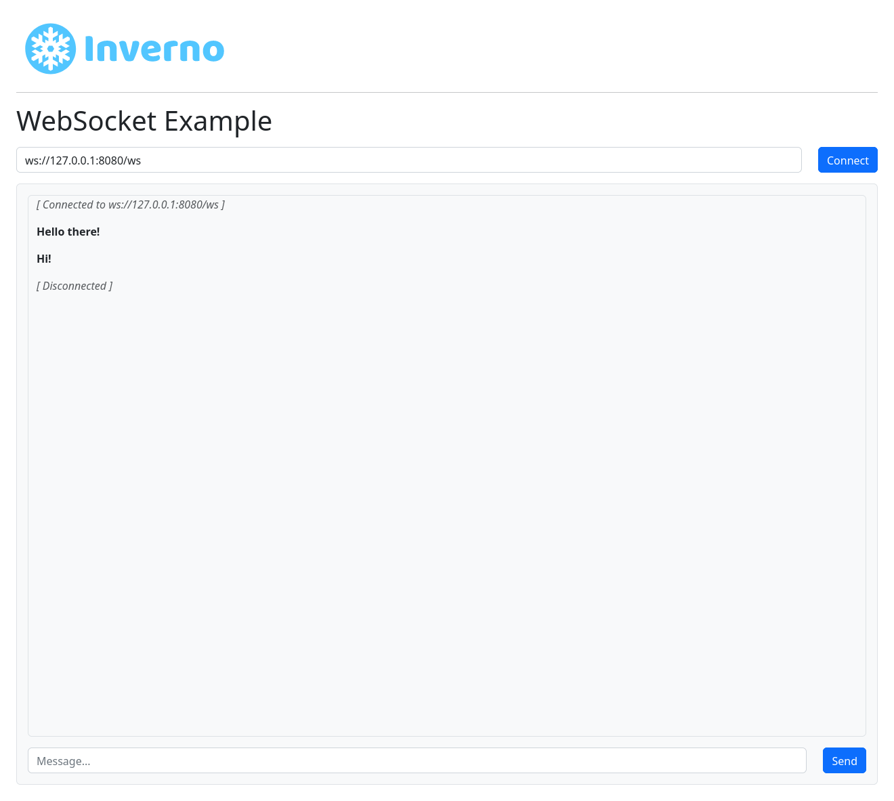

[inverno-mod-http-server]: https://github.com/inverno-io/inverno-mods/blob/master/doc/reference-guide.md#http-server
[inverno-core-root-doc]: https://github.com/inverno-io/inverno-core/blob/master/doc/reference-guide.md
[inverno-javadoc]: https://inverno.io/docs/release/api/index.html

[epoll]: https://en.wikipedia.org/wiki/Epoll
[graalvm]: https://www.graalvm.org/

# Inverno HTTP server WebSocket example

A sample application showing how to use the HTTP server module to create a WebSocket server.

The HTTP server configuration is exposed in the module's configuration `App_http_websocketConfiguration`.

The server is also configured to use [epoll][epoll] when available (ie. on Linux platform) for better performance.

## Running the example

```plaintext
$ mvn inverno:run
2021-04-26 10:15:53,299 INFO  [main] i.w.c.v.Application - Inverno is starting...


     ╔════════════════════════════════════════════════════════════════════════════════════════════╗
     ║                      , ~~ ,                                                                ║
     ║                  , '   /\   ' ,                                                            ║
     ║                 , __   \/   __ ,      _                                                    ║
     ║                ,  \_\_\/\/_/_/  ,    | |  ___  _    _  ___   __  ___   ___                 ║
     ║                ,    _\_\/_/_    ,    | | / _ \\ \  / // _ \ / _|/ _ \ / _ \                ║
     ║                ,   __\_/\_\__   ,    | || | | |\ \/ /|  __/| | | | | | |_| |               ║
     ║                 , /_/ /\/\ \_\ ,     |_||_| |_| \__/  \___||_| |_| |_|\___/                ║
     ║                  ,     /\     ,                                                            ║
     ║                    ,   \/   ,                                  -- ${VERSION_INVERNO_CORE} --                 ║
     ║                      ' -- '                                                                ║
     ╠════════════════════════════════════════════════════════════════════════════════════════════╣
     ║ Java runtime        : OpenJDK Runtime Environment                                          ║
     ║ Java version        : 17.0.2+8-86                                                          ║
     ║ Java home           : /home/jkuhn/Devel/jdk/jdk-17.0.2                                     ║
     ║                                                                                            ║
     ║ Application module  : io.inverno.example.app_http_websocket                                ║
     ║ Application version : 1.0.0-SNAPSHOT                                                       ║
     ║ Application class   : io.inverno.example.app_http_websocket.Main                           ║
     ║                                                                                            ║
     ║ Modules             :                                                                      ║
     ║  * ...                                                                                     ║
     ╚════════════════════════════════════════════════════════════════════════════════════════════╝


2022-07-07 15:34:05,926 INFO  [main] i.i.e.a.App_http_websocket - Starting Module io.inverno.example.app_http_websocket...
2022-07-07 15:34:05,927 INFO  [main] i.i.m.b.Boot - Starting Module io.inverno.mod.boot...
2022-07-07 15:34:06,140 INFO  [main] i.i.m.b.Boot - Module io.inverno.mod.boot started in 213ms
2022-07-07 15:34:06,140 INFO  [main] i.i.m.h.s.Server - Starting Module io.inverno.mod.http.server...
2022-07-07 15:34:06,141 INFO  [main] i.i.m.h.b.Base - Starting Module io.inverno.mod.http.base...
2022-07-07 15:34:06,145 INFO  [main] i.i.m.h.b.Base - Module io.inverno.mod.http.base started in 4ms
2022-07-07 15:34:06,220 INFO  [main] i.i.m.h.s.i.HttpServer - HTTP Server (nio) listening on http://0.0.0.0:8080
2022-07-07 15:34:06,221 INFO  [main] i.i.m.h.s.Server - Module io.inverno.mod.http.server started in 80ms
2022-07-07 15:34:06,221 INFO  [main] i.i.e.a.App_http_websocket - Module io.inverno.example.app_http_websocket started in 296ms
2022-07-07 15:34:06,224 INFO  [main] i.i.c.v.Application - Application io.inverno.example.app_http_websocket started in 339ms
```

The application is accessible at the following location: http://127.0.0.1:8080, it shows a simplistic chat application backed by a WebSocket:



## Building a native image

Using [GraalVM][graalvm], you can also build a native image of the application with the following command:

```plaintext
> mvn clean package -Pnative
```

You can then run the native application:

```plaintext
> ./target/inverno-example-http-websocket
2022-07-07 15:49:14,591 INFO  [main] i.i.c.v.Application - Inverno is starting...


     ╔════════════════════════════════════════════════════════════════════════════════════════════╗
     ║                      , ~~ ,                                                                ║
     ║                  , '   /\   ' ,                                                            ║
     ║                 , __   \/   __ ,      _                                                    ║
     ║                ,  \_\_\/\/_/_/  ,    | |  ___  _    _  ___   __  ___   ___                 ║
     ║                ,    _\_\/_/_    ,    | | / _ \\ \  / // _ \ / _|/ _ \ / _ \                ║
     ║                ,   __\_/\_\__   ,    | || | | |\ \/ /|  __/| | | | | | |_| |               ║
     ║                 , /_/ /\/\ \_\ ,     |_||_| |_| \__/  \___||_| |_| |_|\___/                ║
     ║                  ,     /\     ,                                                            ║
     ║                    ,   \/   ,                                   << n/a >>                  ║
     ║                      ' -- '                                                                ║
     ╠════════════════════════════════════════════════════════════════════════════════════════════╣
     ║ Java runtime        :                                                                      ║
     ║ Java version        :                                                                      ║
     ║ Java home           :                                                                      ║
     ╚════════════════════════════════════════════════════════════════════════════════════════════╝


2022-07-07 15:49:14,591 INFO  [main] i.i.e.a.App_http_websocket - Starting Module io.inverno.example.app_http_websocket...
2022-07-07 15:49:14,591 INFO  [main] i.i.m.b.Boot - Starting Module io.inverno.mod.boot...
2022-07-07 15:49:14,594 INFO  [main] i.i.m.b.Boot - Module io.inverno.mod.boot started in 3ms
2022-07-07 15:49:14,594 INFO  [main] i.i.m.h.s.Server - Starting Module io.inverno.mod.http.server...
2022-07-07 15:49:14,594 INFO  [main] i.i.m.h.b.Base - Starting Module io.inverno.mod.http.base...
2022-07-07 15:49:14,594 INFO  [main] i.i.m.h.b.Base - Module io.inverno.mod.http.base started in 0ms
2022-07-07 15:49:14,595 INFO  [main] i.i.m.h.s.i.HttpServer - HTTP Server (nio) listening on http://0.0.0.0:8080
2022-07-07 15:49:14,595 INFO  [main] i.i.m.h.s.Server - Module io.inverno.mod.http.server started in 1ms
2022-07-07 15:49:14,595 INFO  [main] i.i.e.a.App_http_websocket - Module io.inverno.example.app_http_websocket started in 4ms
2022-07-07 15:49:14,595 INFO  [main] i.i.c.v.Application - Application io.inverno.example.app_http_websocket started in 4ms
```

> Note that although the startup time has been drastically reduced, native transport is not supported in native image which has a significant impact on performances.

## Going further

- [HTTP server module documentation][inverno-mod-http-server]
- [Inverno core documentation][inverno-core-root-doc]
- [API documentation][inverno-javadoc]
