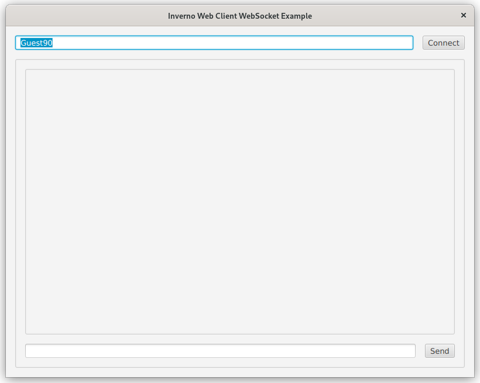
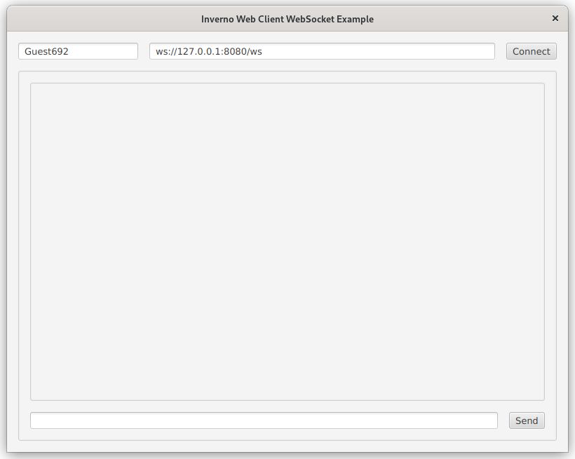
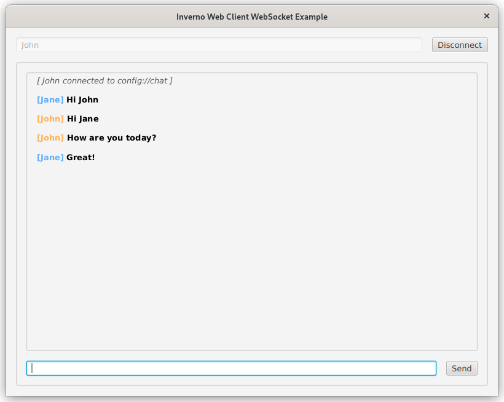

[inverno-core-root-doc]: https://github.com/inverno-io/inverno-core/blob/master/doc/reference-guide.md
[inverno-dist-root]: https://github.com/inverno-io/inverno-dist
[inverno-tool-maven-plugin]: https://github.com/inverno-io/inverno-tools/blob/master/inverno-maven-plugin
[inverno-javadoc]: https://inverno.io/docs/release/api/index.html

[inverno-mod-discovery]: https://github.com/inverno-io/inverno-mods/blob/master/inverno-mod-discovery/
[inverno-mod-discovery-http]: https://github.com/inverno-io/inverno-mods/blob/master/inverno-mod-discovery-http/
[inverno-mod-discovery-http-meta]: https://github.com/inverno-io/inverno-mods/blob/master/inverno-mod-discovery-http-meta/
[inverno-mod-http-client]: https://github.com/inverno-io/inverno-mods/blob/master/inverno-http-client/
[inverno-mod-web-client]: https://github.com/inverno-io/inverno-mods/blob/master/inverno-web-client/
[inverno-examples-http-client-websocket]: ../inverno-example-http-client-websocket
[inverno-examples-web-server-websocket]: ../inverno-example-web-server-websocket

[epoll]: https://en.wikipedia.org/wiki/Epoll

# Inverno Web client example

A sample application showing how to use the Web client module to create programmatic or declarative WebSocket clients supporting automatic content encoding/decoding and service discovery.

The application is a simple chat application UI similar to the [HTTP client WebSocket example application][inverno-examples-http-client-websocket], it can be started in two modes to use either a declarative WebSocket (default) or a programmatic WebSocket client. Unlike the programmatic mode which allows to specify the WebSocket URI, the declarative client connects to a configuration service URI (i.e. `conf://chat`) pointing to a DNS WebSocket URI in `src/main/resources/configuration.cprops`. In both cases the application demonstrate automatic message conversion by receiving and sending `Message` in JSON from/to the [Web server WebSocket sample application][inverno-examples-web-server-websocket].

The client is configured to use [epoll][epoll] when available (i.e. on Linux platform) for better performance.

The Maven build descriptor also defines a `release` profile which builds a native application image in a `zip` archive.

## Running the application

The application can be started in the `DECLARATIVE` mode using the Inverno Maven plugin as follows:

```plaintext
$ mvn inverno:run -Dinverno.run.arguments="--io.inverno.example.app_web_client_websocket.appConfiguration.mode=\\\"DECLARATIVE\\\""
2024-09-17 10:44:19,115 INFO  [main] i.i.c.v.Application - Inverno is starting...


     ╔════════════════════════════════════════════════════════════════════════════════════════════╗
     ║                      , ~~ ,                                                                ║
     ║                  , '   /\   ' ,                                                            ║
     ║                 , __   \/   __ ,      _                                                    ║
     ║                ,  \_\_\/\/_/_/  ,    | |  ___  _    _  ___   __  ___   ___                 ║
     ║                ,    _\_\/_/_    ,    | | / _ \\ \  / // _ \ / _|/ _ \ / _ \                ║
     ║                ,   __\_/\_\__   ,    | || | | |\ \/ /|  __/| | | | | | |_| |               ║
     ║                 , /_/ /\/\ \_\ ,     |_||_| |_| \__/  \___||_| |_| |_|\___/                ║
     ║                  ,     /\     ,                                                            ║
     ║                    ,   \/   ,                                  -- ${VERSION_INVERNO_CORE} --                 ║
     ║                      ' -- '                                                                ║
     ╠════════════════════════════════════════════════════════════════════════════════════════════╣
     ║ Java runtime        : Java(TM) SE Runtime Environment                                      ║
     ║ Java version        : 21.0.2+13-LTS-jvmci-23.1-b30                                         ║
     ║ Java home           : /home/jkuhn/Devel/jdk/graalvm-jdk-21.0.2+13.1                        ║
     ║                                                                                            ║
     ║ Application module  : io.inverno.example.app_web_client_websocket                          ║
     ║ Application version : 1.0.0-SNAPSHOT                                                       ║
     ║ Application class   : io.inverno.example.app_web_client_websocket.Main                     ║
     ║                                                                                            ║
     ║ Modules             :                                                                      ║
     ║  * ...                                                                                     ║
     ╚════════════════════════════════════════════════════════════════════════════════════════════╝


2024-09-17 10:44:19,121 INFO  [main] i.i.e.a.App_web_client_websocket - Starting Module io.inverno.example.app_web_client_websocket...
2024-09-17 10:44:19,122 INFO  [main] i.i.m.b.Boot - Starting Module io.inverno.mod.boot...
2024-09-17 10:44:19,406 INFO  [main] i.i.m.b.Boot - Module io.inverno.mod.boot started in 284ms
2024-09-17 10:44:19,406 INFO  [main] i.i.m.d.h.Http - Starting Module io.inverno.mod.discovery.http...
2024-09-17 10:44:19,406 INFO  [main] i.i.m.h.c.Client - Starting Module io.inverno.mod.http.client...
2024-09-17 10:44:19,406 INFO  [main] i.i.m.h.b.Base - Starting Module io.inverno.mod.http.base...
2024-09-17 10:44:19,411 INFO  [main] i.i.m.h.b.Base - Module io.inverno.mod.http.base started in 5ms
2024-09-17 10:44:19,419 INFO  [main] i.i.m.h.c.Client - Module io.inverno.mod.http.client started in 12ms
2024-09-17 10:44:19,420 INFO  [main] i.i.m.d.h.Http - Module io.inverno.mod.discovery.http started in 13ms
2024-09-17 10:44:19,420 INFO  [main] i.i.m.d.h.c.Config - Starting Module io.inverno.mod.discovery.http.meta...
2024-09-17 10:44:19,501 INFO  [main] i.i.m.d.h.c.Config - Module io.inverno.mod.discovery.http.meta started in 81ms
2024-09-17 10:44:19,502 INFO  [main] i.i.m.w.c.Client - Starting Module io.inverno.mod.web.client...
2024-09-17 10:44:19,502 INFO  [main] i.i.m.w.b.Base - Starting Module io.inverno.mod.web.base...
2024-09-17 10:44:19,502 INFO  [main] i.i.m.h.b.Base - Starting Module io.inverno.mod.http.base...
2024-09-17 10:44:19,502 INFO  [main] i.i.m.h.b.Base - Module io.inverno.mod.http.base started in 0ms
2024-09-17 10:44:19,503 INFO  [main] i.i.m.w.b.Base - Module io.inverno.mod.web.base started in 1ms
2024-09-17 10:44:19,517 INFO  [main] i.i.m.w.c.Client - Module io.inverno.mod.web.client started in 15ms
2024-09-17 10:44:19,758 INFO  [main] i.i.e.a.App_web_client_websocket - Module io.inverno.example.app_web_client_websocket started in 639ms
2024-09-17 10:44:19,758 INFO  [main] i.i.c.v.Application - Application io.inverno.example.app_web_client_websocket started in 706ms
```

You should now be able to use the JavaFX UI to connect to the WebSocket server, send and receive messages



When started with the `PROGRAMMATIC` mode, the WebSocket URI can be specified in the UI:

```plaintext
$ mvn inverno:run -Dinverno.run.arguments="--io.inverno.example.app_web_client_websocket.appConfiguration.mode=\\\"PROGRAMMATIC\\\""
...
```



Assuming the [Web server WebSocket sample application][inverno-examples-web-server-websocket] has been started, you can exchange messages:



## Packaging the application

The application can be packaged as a native runtime image by invoking the `release` build profile:

```plaintext
$ mvn install -Prelease
...
[INFO] --- inverno:${VERSION_INVERNO_TOOLS}:package-app (inverno-package-app) @ inverno-example-web-client-websocket ---
 [═══════════════════════════════════════════════ 100 % ══════════════════════════════════════════════] Project application archives created: zip
[INFO] 
[INFO] --- install:3.1.1:install (default-install) @ inverno-example-web-client-websocket ---
[INFO] Installing /home/jkuhn/Devel/git/winter/inverno-examples/inverno-example-web-client-websocket/pom.xml to /home/jkuhn/.m2/repository/io/inverno/example/inverno-example-web-client-websocket/1.0.0-SNAPSHOT/inverno-example-web-client-websocket-1.0.0-SNAPSHOT.pom
[INFO] Installing /home/jkuhn/Devel/git/winter/inverno-examples/inverno-example-web-client-websocket/target/inverno-example-web-client-websocket-1.0.0-SNAPSHOT.jar to /home/jkuhn/.m2/repository/io/inverno/example/inverno-example-web-client-websocket/1.0.0-SNAPSHOT/inverno-example-web-client-websocket-1.0.0-SNAPSHOT.jar
[INFO] Installing /home/jkuhn/Devel/git/winter/inverno-examples/inverno-example-web-client-websocket/target/inverno-example-web-client-websocket-1.0.0-SNAPSHOT-application_linux_amd64.zip to /home/jkuhn/.m2/repository/io/inverno/example/inverno-example-web-client-websocket/1.0.0-SNAPSHOT/inverno-example-web-client-websocket-1.0.0-SNAPSHOT-application_linux_amd64.zip
[INFO] ------------------------------------------------------------------------
[INFO] BUILD SUCCESS
[INFO] ------------------------------------------------------------------------
```

The previous command creates folder `target/inverno-example-web-client-websocket-1.0.0-SNAPSHOT-application_linux_amd64` containing the Java runtime and the application and installed the corresponding archive to the Maven repository:

```plaintext
$ ./target/inverno-example-web-client-websocket-1.0.0-SNAPSHOT-application_linux_amd64/bin/example-web-client-websocket
...
```

## Going further

- [HTTP client module documentation][inverno-mod-http-client]
- [Web client module documentation][inverno-mod-web-client]
- [Discovery API module documentation][inverno-mod-discovery]
- [Discovery HTTP module documentation][inverno-mod-discovery-http]
- [Discovery HTTP Metadata module documentation][inverno-mod-discovery-http-meta]
- [Inverno distribution documentation][inverno-dist-root]
- [Inverno Maven plugin documentation][inverno-tool-maven-plugin]
- [Inverno core documentation][inverno-core-root-doc]
- [API documentation][inverno-javadoc]