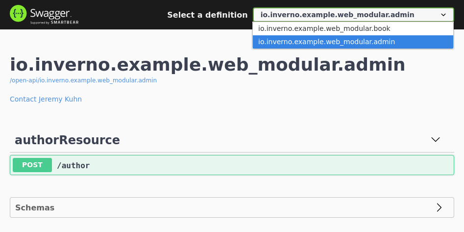

[inverno-mod-http-server]: https://github.com/inverno-io/inverno-mods/blob/master/doc/reference-guide.md#http-server
[inverno-mod-web]: https://github.com/inverno-io/inverno-mods/blob/master/doc/reference-guide.md#web
[inverno-dist-root]: https://github.com/inverno-io/inverno-dist
[inverno-core-root-doc]: https://github.com/inverno-io/inverno-core/blob/master/doc/reference-guide.md
[inverno-tool-maven-plugin]: https://github.com/inverno-io/inverno-tools/blob/master/inverno-maven-plugin
[inverno-javadoc]: https://inverno.io/docs/release/api/index.html

# Inverno Web modular example

A sample Inverno application that shows how to create a modular Web application composed of three modules:

- *admin* module which provides some admin REST resources
- *book* module which provides the book REST resource
- *app* module which composes previous modules with the Inverno *web* module

It is not fundamentally different than the [Web application example](../inverno-example-web/) but it shows how Web controllers and Web router configurer are aggregated into one single Web router configurer wired to the Web server to configure the exposed routes.

## Building the example

The project can be built with the following command:

```plaintext
$ mvn clean install
```

## Running the example

Previous command should have installed a native application packaged to the local Maven repository, we can run the application by retrieving and extracting this package to a location of our choice:

```plaintext
$ mvn dependency:unpack -Dartifact=io.inverno.example.inverno-example-web-modular:app:1.0.0-SNAPSHOT:zip:application_linux_amd64 -DoutputDirectory=./
```
```plaintext
$ ./inverno-example-web-modular-1.0.0-SNAPSHOT/bin/app
```

If we open the SwaggerUI at `http://localhost:8080/open-api`, we should see that we have two OpenAPI specifications corresponding to modules *admin* and *book*:



## Going further

- [HTTP server module documentation][inverno-mod-http-server]
- [Inverno server module documentation][inverno-mod-web]
- [Inverno distribution documentation][inverno-dist-root]
- [Inverno Maven plugin documentation][inverno-tool-maven-plugin]
- [Inverno core documentation][inverno-core-root-doc]
- [API documentation][inverno-javadoc]