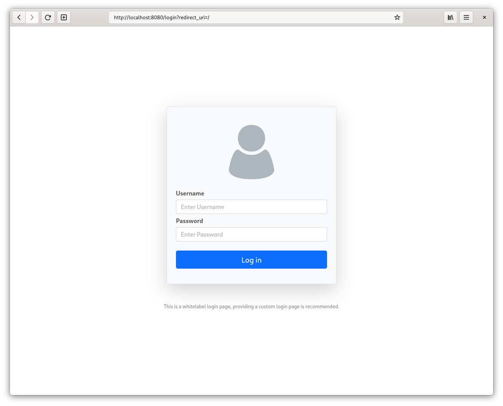
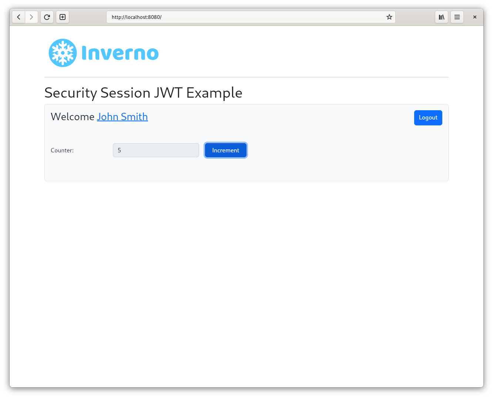
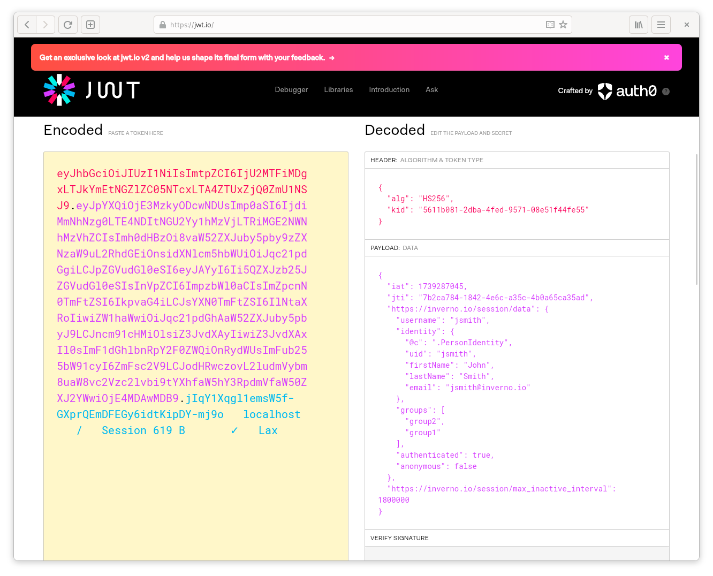

[inverno-core-root-doc]: https://github.com/inverno-io/inverno-core/blob/master/doc/reference-guide.md
[inverno-dist-root]: https://github.com/inverno-io/inverno-dist
[inverno-tool-maven-plugin]: https://github.com/inverno-io/inverno-tools/blob/master/inverno-maven-plugin
[inverno-javadoc]: https://inverno.io/docs/release/api/index.html

[inverno-mod-http-server]: https://github.com/inverno-io/inverno-mods/blob/master/inverno-http-server/
[inverno-mod-web-server]: https://github.com/inverno-io/inverno-mods/blob/master/inverno-web-server/
[inverno-mod-security-http]: https://github.com/inverno-io/inverno-mods/blob/master/inverno-security-http/
[inverno-mod-security-jose]: https://github.com/inverno-io/inverno-mods/blob/master/inverno-security-jose/
[inverno-mod-session]: https://github.com/inverno-io/inverno-mods/blob/master/inverno-session/
[inverno-mod-session-http]: https://github.com/inverno-io/inverno-mods/blob/master/inverno-session-http/

[redis]: https://redis.io

# Inverno Web server security JWT session example

A sample Inverno application showing how to secure a Web application using JWT sessions to store `Authentication`.

Unlike basic sessions, which use opaque session ids, JWT session use JWT session ids which allow to specify stateless session data and authentication data in particular, limiting the interactions with the session store.

The configuration is exposed in the module's configuration `AppConfiguration` and allows to enable the [Redis][redis] session store.

It defines the `AppWebServerConfigurer` which configures the Web server security with JWT session support. The `AppSessionController` defines a simple REST API for incrementing a counter stored in the session and getting authenticated user profile.

The server root points to `src/main/resources/index.html` which provides a frontend for above API. Both frontend and API are secured using a Form login authentication flow backed by an in-memory user repository with a single user: `jsmith/password`.

The Maven build descriptor also defines three build profiles:

- `release` which builds a native application image in a `zip` archive.
- `release-image` which builds a Docker container image of the application in a `tar` archive.
- `install-image` which installs the Docker container image of the application to a local docker daemon.

## Running the application

The application is started using the Inverno Maven plugin as follows:

```plaintext
$ mvn inverno:run
...
2025-02-11 16:12:47,651 INFO  [main] i.i.e.a.AppSessionStore - Using JWS session Id
2025-02-11 16:12:47,651 INFO  [main] i.i.e.a.AppSessionStore - Using InMemoryJWTSessionStore
2025-02-11 16:12:47,684 INFO  [main] i.i.e.a.App_web_server_security_session_jwt - Module io.inverno.example.app_web_server_security_session_jwt started in 281ms
2025-02-11 16:12:47,684 INFO  [main] i.i.c.v.Application - Application io.inverno.example.app_web_server_security_session_jwt started in 320ms
```

It uses an `InMemorySessionStore` and a `JWTSSessionIdGenerator` by default, properties `io.inverno.example.app_web_server_security_session_jwt.appConfiguration.useRedisSessionStore` and/or `io.inverno.example.app_web_server_security_session_jwt.appConfiguration.useJWE` must be set as follows to switch to a `RedisSessionStore` and/or a `JWTESessionIdGenerator`:

```plaintext
$ mvn inverno:run -Dinverno.run.arguments="--io.inverno.example.app_web_server_security_session_jwt.appConfiguration.useRedisSessionStore=true --io.inverno.example.app_web_server_security_session_jwt.appConfiguration.useJWE=true"
...
2025-02-11 16:13:53,535 INFO  [main] i.i.e.a.AppSessionStore - Using JWE session Id
2025-02-11 16:13:53,535 INFO  [main] i.i.e.a.AppSessionStore - Using RedisSessionStore
2025-02-11 16:13:53,589 INFO  [main] i.i.e.a.App_web_server_security_session_jwt - Module io.inverno.example.app_web_server_security_session_jwt started in 331ms
2025-02-11 16:13:53,589 INFO  [main] i.i.c.v.Application - Application io.inverno.example.app_web_server_security_session_jwt started in 371ms
```

A local Redis server listening on port `6379` is then required, it can be started as follows using Docker:

```plaintext
$ docker run -d -p6379:6379 redis
```

The frontend is exposed at http://localhost:8080 which redirects to the login page if there is no authenticated session:



After login with user `jsmith/password`, you should be redirected to the frontend displaying user profile information (first name and last name) and the session counter:



The session id shall contain authentication data which then don't need to be kept in the session store:



> Considering an application which doesn't need stateful session data, the interaction with the session store would be limited to checking for existence and update expiration parameters (basically touch the session in case a maximum inactive interval has been set). 

## Packaging the application

The application can be packaged as a native runtime image by invoking the `release` build profile:

```plaintext
$ mvn install -Prelease
...
 [═══════════════════════════════════════════════ 100 % ══════════════════════════════════════════════] Project application archives created: zip
[INFO] 
[INFO] --- install:3.1.3:install (default-install) @ inverno-example-web-server-security-session-jwt ---
[INFO] Installing /home/jkuhn/Devel/git/winter/inverno-examples/inverno-example-web-server-security-session-jwt/pom.xml to /home/jkuhn/.m2/repository/io/inverno/example/inverno-example-web-server-security-session-jwt/1.0.0-SNAPSHOT/inverno-example-web-server-security-session-jwt-1.0.0-SNAPSHOT.pom
[INFO] Installing /home/jkuhn/Devel/git/winter/inverno-examples/inverno-example-web-server-security-session-jwt/target/inverno-example-web-server-security-session-jwt-1.0.0-SNAPSHOT.jar to /home/jkuhn/.m2/repository/io/inverno/example/inverno-example-web-server-security-session-jwt/1.0.0-SNAPSHOT/inverno-example-web-server-security-session-jwt-1.0.0-SNAPSHOT.jar
[INFO] Installing /home/jkuhn/Devel/git/winter/inverno-examples/inverno-example-web-server-security-session-jwt/target/inverno-example-web-server-security-session-jwt-1.0.0-SNAPSHOT-application_linux_amd64.zip to /home/jkuhn/.m2/repository/io/inverno/example/inverno-example-web-server-security-session-jwt/1.0.0-SNAPSHOT/inverno-example-web-server-security-session-jwt-1.0.0-SNAPSHOT-application_linux_amd64.zip
[INFO] ------------------------------------------------------------------------
[INFO] BUILD SUCCESS
[INFO] ------------------------------------------------------------------------
```

The previous command creates folder `target/inverno-example-web-server-security-session-jwt-1.0.0-SNAPSHOT-application_linux_amd64` containing the Java runtime and the application and installed the corresponding archive to the Maven repository:

```plaintext
$ ./target/inverno-example-web-server-security-session-jwt-1.0.0-SNAPSHOT-application_linux_amd64/bin/example-web-server-security-session-jwt
...
```

A portable docker image of the application can be created as a `tar` archive by invoking the `release-image` build profile:

```plaintext
$ mvn install -Prelease-image
...
[INFO] --- inverno:${VERSION_INVERNO_TOOLS}:package-image (inverno-package-image) @ inverno-example-web-server-security ---
 [═══════════════════════════════════════════════ 100 % ══════════════════════════════════════════════] Project Docker container image TAR archive created
[INFO] 
[INFO] --- install:3.1.3:install (default-install) @ inverno-example-web-server-security-session-jwt ---
[INFO] Installing /home/jkuhn/Devel/git/winter/inverno-examples/inverno-example-web-server-security-session-jwt/pom.xml to /home/jkuhn/.m2/repository/io/inverno/example/inverno-example-web-server-security-session-jwt/1.0.0-SNAPSHOT/inverno-example-web-server-security-session-jwt-1.0.0-SNAPSHOT.pom
[INFO] Installing /home/jkuhn/Devel/git/winter/inverno-examples/inverno-example-web-server-security-session-jwt/target/inverno-example-web-server-security-session-jwt-1.0.0-SNAPSHOT.jar to /home/jkuhn/.m2/repository/io/inverno/example/inverno-example-web-server-security-session-jwt/1.0.0-SNAPSHOT/inverno-example-web-server-security-session-jwt-1.0.0-SNAPSHOT.jar
[INFO] Installing /home/jkuhn/Devel/git/winter/inverno-examples/inverno-example-web-server-security-session-jwt/target/inverno-example-web-server-security-session-jwt-1.0.0-SNAPSHOT-container_linux_amd64.tar to /home/jkuhn/.m2/repository/io/inverno/example/inverno-example-web-server-security-session-jwt/1.0.0-SNAPSHOT/inverno-example-web-server-security-session-jwt-1.0.0-SNAPSHOT-container_linux_amd64.tar
[INFO] ------------------------------------------------------------------------
[INFO] BUILD SUCCESS
[INFO] ------------------------------------------------------------------------
```

The previous command should create archive `target/inverno-example-web-server-security-session-jwt-1.0.0-SNAPSHOT-container_linux_amd64.tar` docker image that can be loaded into docker as follows:

```plaintext
$ docker load --input target/inverno-example-web-server-security-session-jwt-1.0.0-SNAPSHOT-container_linux_amd64.tar
```

The application can be directly deployed to a local docker daemon by invoking the `install-image` build profile:

```plaintext
$ mvn install -Pinstall-image
...
[INFO] --- inverno:${VERSION_INVERNO_TOOLS}:install-image (inverno-install-image) @ inverno-example-web-server-security ---
 [═══════════════════════════════════════════════ 100 % ══════════════════════════════════════════════] Project Docker container image deployed to Docker daemon
[INFO] Project image inverno-example-web-server-security-session-jwt:1.0.0-SNAPSHOT installed to Docker
[INFO] ------------------------------------------------------------------------
[INFO] BUILD SUCCESS
[INFO] ------------------------------------------------------------------------
```

The application can then be started in docker as follows:

```plaintext
$ docker run --rm --network host inverno-example-web-server-security-session-jwt:1.0.0-SNAPSHOT
...
2025-02-11 15:26:35,712 INFO  [main] i.i.m.h.s.i.HttpServer - HTTP Server (epoll) listening on http://0.0.0.0:8080
2025-02-11 15:26:35,712 INFO  [main] i.i.m.h.s.Server - Module io.inverno.mod.http.server started in 16ms
2025-02-11 15:26:35,712 INFO  [main] i.i.m.w.s.Server - Module io.inverno.mod.web.server started in 16ms
2025-02-11 15:26:35,714 INFO  [main] i.i.e.a.AppSessionStore - Using JWS session Id
2025-02-11 15:26:35,714 INFO  [main] i.i.e.a.AppSessionStore - Using InMemoryJWTSessionStore
2025-02-11 15:26:35,739 INFO  [main] i.i.e.a.App_web_server_security_session_jwt - Module io.inverno.example.app_web_server_security_session_jwt started in 286ms
2025-02-11 15:26:35,739 INFO  [main] i.i.c.v.Application - Application io.inverno.example.app_web_server_security_session_jwt started in 314ms
```

## Going further

- [HTTP server module documentation][inverno-mod-http-server]
- [Web server module documentation][inverno-mod-web-server]
- [HTTP Security module documentation][inverno-mod-security-http]
- [Session module documentation][inverno-mod-session]
- [HTTP Session module documentation][inverno-mod-session-http]
- [JOSE Security module documentation][inverno-mod-security-jose]
- [Inverno distribution documentation][inverno-dist-root]
- [Inverno Maven plugin documentation][inverno-tool-maven-plugin]
- [Inverno core documentation][inverno-core-root-doc]
- [API documentation][inverno-javadoc]