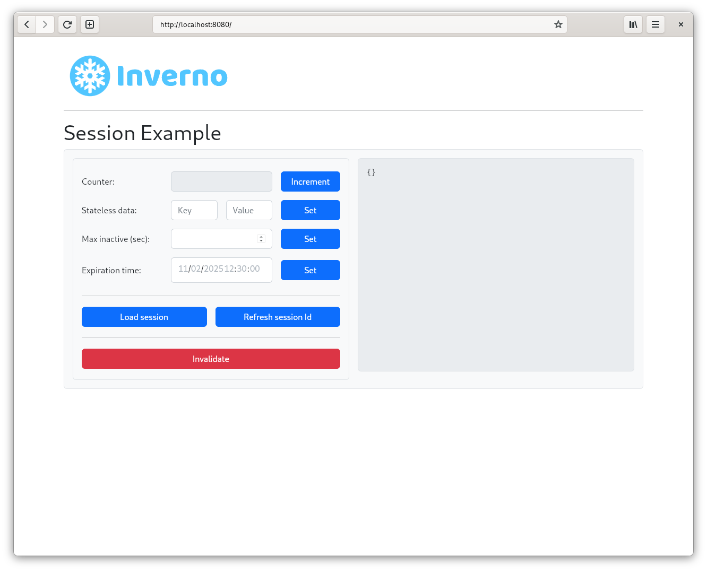
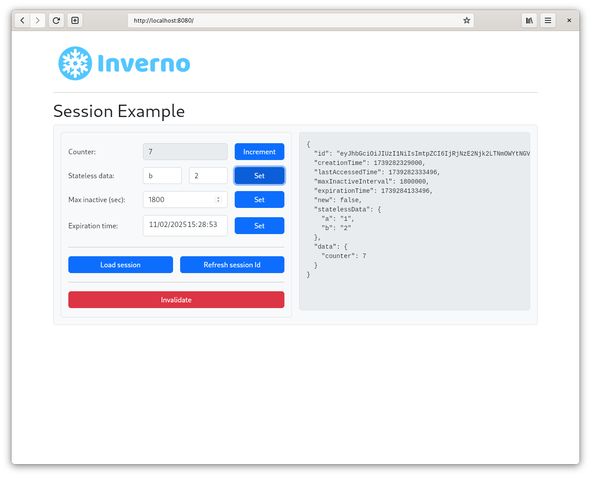
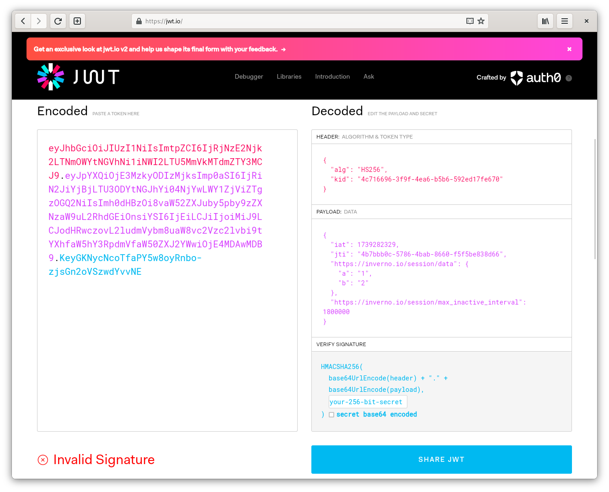

[inverno-core-root-doc]: https://github.com/inverno-io/inverno-core/blob/master/doc/reference-guide.md
[inverno-dist-root]: https://github.com/inverno-io/inverno-dist
[inverno-tool-maven-plugin]: https://github.com/inverno-io/inverno-tools/blob/master/inverno-maven-plugin
[inverno-javadoc]: https://inverno.io/docs/release/api/index.html

[inverno-mod-http-server]: https://github.com/inverno-io/inverno-mods/blob/master/inverno-http-server/
[inverno-mod-web-server]: https://github.com/inverno-io/inverno-mods/blob/master/inverno-web-server/
[inverno-mod-security-jose]: https://github.com/inverno-io/inverno-mods/blob/master/inverno-security-jose/
[inverno-mod-session]: https://github.com/inverno-io/inverno-mods/blob/master/inverno-session/
[inverno-mod-session-http]: https://github.com/inverno-io/inverno-mods/blob/master/inverno-session-http/

[redis]: https://redis.io

# Inverno Web server session JWT example

A sample Inverno application showing how to use the Session modules to support JWT session in a Web application. 

Unlike basic sessions, which use opaque session ids, JWT session use JWT session ids which allow to specify stateless session data, limiting the interactions with the session store.

The configuration is exposed in the module's configuration `AppConfiguration` and allows to enable the [Redis][redis] session store.

It defines the `AppWebServerConfigurer` which configures the Web server with session support. The `AppSessionController` defines a session REST API for interacting with the session: increment a counter stored in the session, update the session expiration by defining maximum inactive interval or explicit expiration time, set stateless data, refresh the session id or invalidate the session.

The server root points to `src/main/resources/index.html` which provides a frontend for above API.

The Maven build descriptor also defines three build profiles:

- `release` which builds a native application image in a `zip` archive.
- `release-image` which builds a Docker container image of the application in a `tar` archive.
- `install-image` which installs the Docker container image of the application to a local docker daemon.

## Running the application

The application is started using the Inverno Maven plugin as follows:

```plaintext
$ mvn inverno:run
...
2025-02-11 14:38:42,872 INFO  [main] i.i.e.a.AppSessionStore - Using JWS session Id
2025-02-11 14:38:42,872 INFO  [main] i.i.e.a.AppSessionStore - Using InMemoryJWTSessionStore
2025-02-11 14:38:42,899 INFO  [main] i.i.e.a.App_web_server_session_jwt - Module io.inverno.example.app_web_server_session_jwt started in 296ms
2025-02-11 14:38:42,900 INFO  [main] i.i.c.v.Application - Application io.inverno.example.app_web_server_session_jwt started in 337ms
```

It uses an `InMemorySessionStore` and a `JWTSSessionIdGenerator` by default, properties `io.inverno.example.app_web_server_session_jwt.appConfiguration.useRedisSessionStore` and/or `io.inverno.example.app_web_server_session_jwt.appConfiguration.useJWE` must be set as follows to switch to a `RedisSessionStore` and/or a `JWTESessionIdGenerator`:

```plaintext
$ mvn inverno:run -Dinverno.run.arguments="--io.inverno.example.app_web_server_session_jwt.appConfiguration.useRedisSessionStore=true --io.inverno.example.app_web_server_session_jwt.appConfiguration.useJWE=true"
...
2025-02-11 14:47:09,069 INFO  [main] i.i.e.a.AppSessionStore - Using JWE session Id
2025-02-11 14:47:09,070 INFO  [main] i.i.e.a.AppSessionStore - Using InMemoryJWTSessionStore
2025-02-11 14:47:09,099 INFO  [main] i.i.e.a.App_web_server_session_jwt - Module io.inverno.example.app_web_server_session_jwt started in 315ms
2025-02-11 14:47:09,099 INFO  [main] i.i.c.v.Application - Application io.inverno.example.app_web_server_session_jwt started in 355ms
```

A local Redis server listening on port `6379` is then required, it can be started as follows using Docker:

```plaintext
$ docker run -d -p6379:6379 redis
```

The frontend is exposed at http://localhost:8080:



The session is only created when first incrementing the counter and displayed on the right panel:



The *Expiration time* field reflects the actual time at which the session expires, in the presence of a maximum inactive interval, it is refreshed each time the session is accessed. When setting a fixed expiration time, the max inactive interval is set to null and the session expires at the specified time.

> Note that since the session is saved after the response has been sent to the Web browser, the displayed last accessed time is actually the one from the last request.

When setting stateless data, the session id is refreshed in order to convey these data:



## Packaging the application

The application can be packaged as a native runtime image by invoking the `release` build profile:

```plaintext
$ mvn install -Prelease
...
 [═══════════════════════════════════════════════ 100 % ══════════════════════════════════════════════] Project application archives created: zip
[INFO] 
[INFO] --- install:3.1.3:install (default-install) @ inverno-example-web-server-session-jwt ---
[INFO] Installing /home/jkuhn/Devel/git/winter/inverno-examples/inverno-example-web-server-session-jwt/pom.xml to /home/jkuhn/.m2/repository/io/inverno/example/inverno-example-web-server-session-jwt/1.0.0-SNAPSHOT/inverno-example-web-server-session-jwt-1.0.0-SNAPSHOT.pom
[INFO] Installing /home/jkuhn/Devel/git/winter/inverno-examples/inverno-example-web-server-session-jwt/target/inverno-example-web-server-session-jwt-1.0.0-SNAPSHOT.jar to /home/jkuhn/.m2/repository/io/inverno/example/inverno-example-web-server-session-jwt/1.0.0-SNAPSHOT/inverno-example-web-server-session-jwt-1.0.0-SNAPSHOT.jar
[INFO] Installing /home/jkuhn/Devel/git/winter/inverno-examples/inverno-example-web-server-session-jwt/target/inverno-example-web-server-session-jwt-1.0.0-SNAPSHOT-application_linux_amd64.zip to /home/jkuhn/.m2/repository/io/inverno/example/inverno-example-web-server-session-jwt/1.0.0-SNAPSHOT/inverno-example-web-server-session-jwt-1.0.0-SNAPSHOT-application_linux_amd64.zip
[INFO] ------------------------------------------------------------------------
[INFO] BUILD SUCCESS
[INFO] ------------------------------------------------------------------------
```

The previous command creates folder `target/inverno-example-web-server-session-jwt-1.0.0-SNAPSHOT-application_linux_amd64` containing the Java runtime and the application and installed the corresponding archive to the Maven repository:

```plaintext
$ ./target/inverno-example-web-server-session-jwt-1.0.0-SNAPSHOT-application_linux_amd64/bin/example-web-server-session-jwt
...
```

A portable docker image of the application can be created as a `tar` archive by invoking the `release-image` build profile:

```plaintext
$ mvn install -Prelease-image
...
[INFO] --- inverno:${VERSION_INVERNO_TOOLS}:package-image (inverno-package-image) @ inverno-example-web-server-security ---
 [═══════════════════════════════════════════════ 100 % ══════════════════════════════════════════════] Project Docker container image TAR archive created
[INFO] 
[INFO] --- install:3.1.3:install (default-install) @ inverno-example-web-server-session-jwt ---
[INFO] Installing /home/jkuhn/Devel/git/winter/inverno-examples/inverno-example-web-server-session-jwt/pom.xml to /home/jkuhn/.m2/repository/io/inverno/example/inverno-example-web-server-session-jwt/1.0.0-SNAPSHOT/inverno-example-web-server-session-jwt-1.0.0-SNAPSHOT.pom
[INFO] Installing /home/jkuhn/Devel/git/winter/inverno-examples/inverno-example-web-server-session-jwt/target/inverno-example-web-server-session-jwt-1.0.0-SNAPSHOT.jar to /home/jkuhn/.m2/repository/io/inverno/example/inverno-example-web-server-session-jwt/1.0.0-SNAPSHOT/inverno-example-web-server-session-jwt-1.0.0-SNAPSHOT.jar
[INFO] Installing /home/jkuhn/Devel/git/winter/inverno-examples/inverno-example-web-server-session-jwt/target/inverno-example-web-server-session-jwt-1.0.0-SNAPSHOT-container_linux_amd64.tar to /home/jkuhn/.m2/repository/io/inverno/example/inverno-example-web-server-session-jwt/1.0.0-SNAPSHOT/inverno-example-web-server-session-jwt-1.0.0-SNAPSHOT-container_linux_amd64.tar
[INFO] ------------------------------------------------------------------------
[INFO] BUILD SUCCESS
[INFO] ------------------------------------------------------------------------
```

The previous command should create archive `target/inverno-example-web-server-session-jwt-1.0.0-SNAPSHOT-container_linux_amd64.tar` docker image that can be loaded into docker as follows:

```plaintext
$ docker load --input target/inverno-example-web-server-session-jwt-1.0.0-SNAPSHOT-container_linux_amd64.tar
```

The application can be directly deployed to a local docker daemon by invoking the `install-image` build profile:

```plaintext
$ mvn install -Pinstall-image
...
[INFO] --- inverno:${VERSION_INVERNO_TOOLS}:install-image (inverno-install-image) @ inverno-example-web-server-security ---
 [═══════════════════════════════════════════════ 100 % ══════════════════════════════════════════════] Project Docker container image deployed to Docker daemon
[INFO] Project image inverno-example-web-server-session:1.0.0-SNAPSHOT installed to Docker
[INFO] ------------------------------------------------------------------------
[INFO] BUILD SUCCESS
[INFO] ------------------------------------------------------------------------
```

The application can then be started in docker as follows:

```plaintext
$ docker run --rm --network host inverno-example-web-server-session-jwt:1.0.0-SNAPSHOT
...
2025-02-11 14:04:12,901 INFO  [main] i.i.m.h.s.i.HttpServer - HTTP Server (epoll) listening on http://0.0.0.0:8080
2025-02-11 14:04:12,902 INFO  [main] i.i.m.h.s.Server - Module io.inverno.mod.http.server started in 17ms
2025-02-11 14:04:12,902 INFO  [main] i.i.m.w.s.Server - Module io.inverno.mod.web.server started in 17ms
2025-02-11 14:04:12,904 INFO  [main] i.i.e.a.AppSessionStore - Using JWS session Id
2025-02-11 14:04:12,904 INFO  [main] i.i.e.a.AppSessionStore - Using InMemoryJWTSessionStore
2025-02-11 14:04:12,926 INFO  [main] i.i.e.a.App_web_server_session_jwt - Module io.inverno.example.app_web_server_session_jwt started in 291ms
2025-02-11 14:04:12,926 INFO  [main] i.i.c.v.Application - Application io.inverno.example.app_web_server_session_jwt started in 318ms
```

## Going further

- [HTTP server module documentation][inverno-mod-http-server]
- [Web server module documentation][inverno-mod-web-server]
- [Session module documentation][inverno-mod-session]
- [HTTP Session module documentation][inverno-mod-session-http]
- [JOSE Security module documentation][inverno-mod-security-jose]
- [Inverno distribution documentation][inverno-dist-root]
- [Inverno Maven plugin documentation][inverno-tool-maven-plugin]
- [Inverno core documentation][inverno-core-root-doc]
- [API documentation][inverno-javadoc]