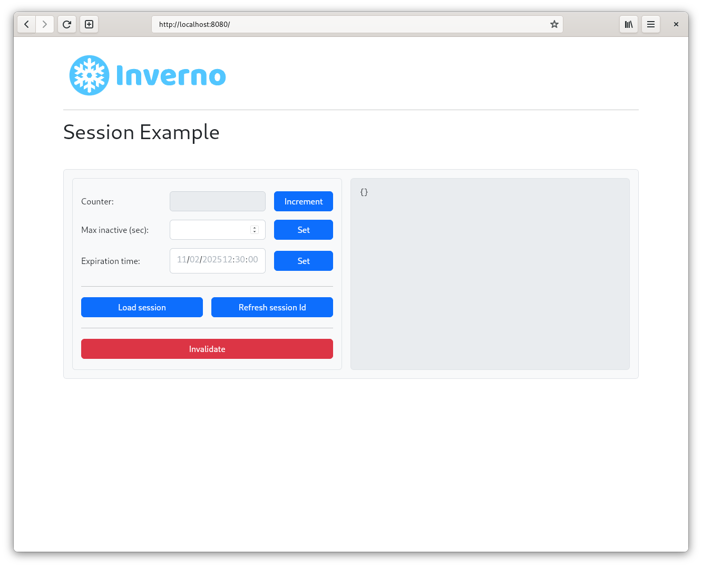
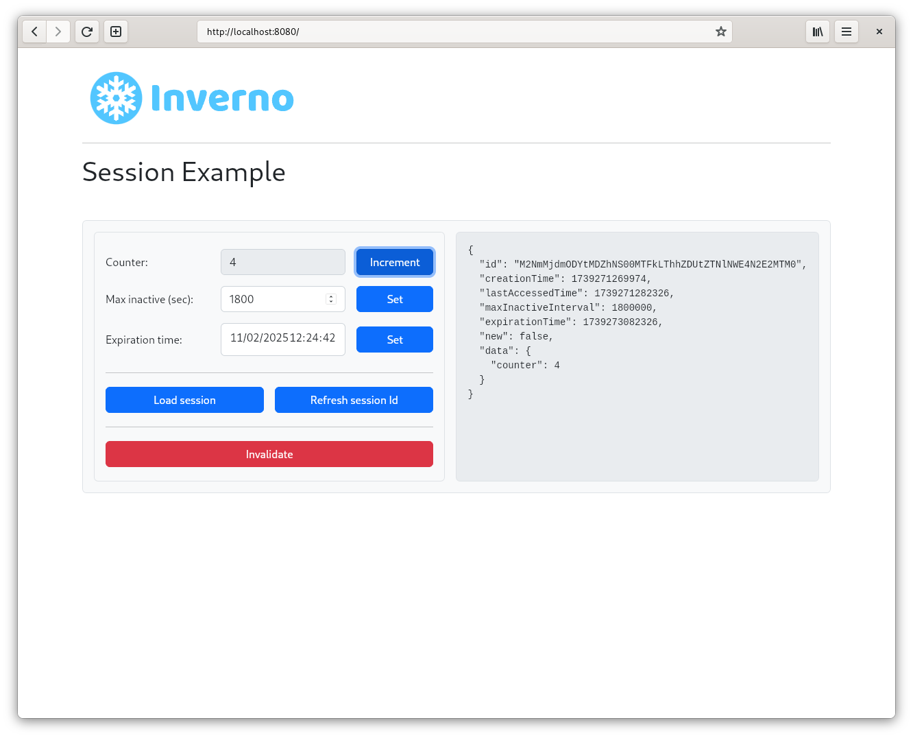

[inverno-core-root-doc]: https://github.com/inverno-io/inverno-core/blob/master/doc/reference-guide.md
[inverno-dist-root]: https://github.com/inverno-io/inverno-dist
[inverno-tool-maven-plugin]: https://github.com/inverno-io/inverno-tools/blob/master/inverno-maven-plugin
[inverno-javadoc]: https://inverno.io/docs/release/api/index.html

[inverno-mod-http-server]: https://github.com/inverno-io/inverno-mods/blob/master/inverno-http-server/
[inverno-mod-web-server]: https://github.com/inverno-io/inverno-mods/blob/master/inverno-web-server/
[inverno-mod-session]: https://github.com/inverno-io/inverno-mods/blob/master/inverno-session/
[inverno-mod-session-http]: https://github.com/inverno-io/inverno-mods/blob/master/inverno-session-http/

[redis]: https://redis.io
[graalvm]: https://www.graalvm.org/
[logback]: https://logback.qos.ch/

# Inverno Web server session example

A sample Inverno application showing how to use the Session modules to support basic session in a Web application.

The configuration is exposed in the module's configuration `AppConfiguration` and allows to enable the [Redis][redis] session store.

It defines the `AppWebServerConfigurer` which configures the Web server with session support. The `AppSessionController` defines a session REST API for interacting with the session: increment a counter stored in the session, update the session expiration by defining maximum inactive interval or explicit expiration time, refresh the session id or invalidate the session.

The server root points to `src/main/resources/index.html` which provides a frontend for above API.

The Maven build descriptor also defines three build profiles:

- `release` which builds a native application image in a `zip` archive.
- `release-image` which builds a Docker container image of the application in a `tar` archive.
- `install-image` which installs the Docker container image of the application to a local docker daemon.

## Running the application

The application is started using the Inverno Maven plugin as follows:

```plaintext
$ mvn inverno:run
...
2025-01-30 11:27:59,989 INFO  [main] i.i.e.a.AppSessionStore - Using InMemorySessionStore
2025-01-30 11:28:00,011 INFO  [main] i.i.e.a.App_web_server_session - Module io.inverno.example.app_web_server_session started in 243ms
2025-01-30 11:28:00,012 INFO  [main] i.i.c.v.Application - Application io.inverno.example.app_web_server_session started in 274ms
```

It uses an `InMemorySessionStore` by default, property `io.inverno.example.app_web_server_session.appConfiguration.useRedisSessionStore` must be enabled to switch to a `RedisSessionStore`:

```plaintext
$ mvn inverno:run -Dinverno.run.arguments="--io.inverno.example.app_web_server_session.appConfiguration.useRedisSessionStore=true"
...
2025-01-30 11:28:47,320 INFO  [main] i.i.e.a.AppSessionStore - Using RedisSessionStore
2025-01-30 11:28:47,367 INFO  [main] i.i.e.a.App_web_server_session - Module io.inverno.example.app_web_server_session started in 265ms
2025-01-30 11:28:47,367 INFO  [main] i.i.c.v.Application - Application io.inverno.example.app_web_server_session started in 296ms
```

A local Redis server listening on port `6379` is then required, it can be started as follows using Docker:

```plaintext
$ docker run -d -p6379:6379 redis
```

The frontend is exposed at http://localhost:8080:



The session is only created when first incrementing the counter and displayed on the right panel:



The *Expiration time* field reflects the actual time at which the session expires, in the presence of a maximum inactive interval, it is refreshed each time the session is accessed. When setting a fixed expiration time, the max inactive interval is set to null and the session expires at the specified time.

> Note that since the session is saved after the response has been sent to the Web browser, the displayed last accessed time is actually the one from the last request.

## Packaging the application

The application can be packaged as a native runtime image by invoking the `release` build profile:

```plaintext
$ mvn install -Prelease
...
[INFO] --- inverno:${VERSION_INVERNO_TOOLS}:package-app (inverno-build-app) @ inverno-example-web-server-security ---
 [═══════════════════════════════════════════════ 100 % ══════════════════════════════════════════════] Project application archives created: zip
[INFO] 
[INFO] --- install:3.1.3:install (default-install) @ inverno-example-web-server-session ---
[INFO] Installing /home/jkuhn/Devel/git/winter/inverno-examples/inverno-example-web-server-session/pom.xml to /home/jkuhn/.m2/repository/io/inverno/example/inverno-example-web-server-session/1.0.0-SNAPSHOT/inverno-example-web-server-session-1.0.0-SNAPSHOT.pom
[INFO] Installing /home/jkuhn/Devel/git/winter/inverno-examples/inverno-example-web-server-session/target/inverno-example-web-server-session-1.0.0-SNAPSHOT.jar to /home/jkuhn/.m2/repository/io/inverno/example/inverno-example-web-server-session/1.0.0-SNAPSHOT/inverno-example-web-server-session-1.0.0-SNAPSHOT.jar
[INFO] Installing /home/jkuhn/Devel/git/winter/inverno-examples/inverno-example-web-server-session/target/inverno-example-web-server-session-1.0.0-SNAPSHOT-application_linux_amd64.zip to /home/jkuhn/.m2/repository/io/inverno/example/inverno-example-web-server-session/1.0.0-SNAPSHOT/inverno-example-web-server-session-1.0.0-SNAPSHOT-application_linux_amd64.zip
[INFO] ------------------------------------------------------------------------
[INFO] BUILD SUCCESS
[INFO] ------------------------------------------------------------------------
```

The previous command creates folder `target/inverno-example-web-server-session-1.0.0-SNAPSHOT-application_linux_amd64` containing the Java runtime and the application and installed the corresponding archive to the Maven repository:

```plaintext
$ ./target/inverno-example-web-server-session-1.0.0-SNAPSHOT-application_linux_amd64/bin/example-web-server-session
...
```

A portable docker image of the application can be created as a `tar` archive by invoking the `release-image` build profile:

```plaintext
$ mvn install -Prelease-image
...
[INFO] --- inverno:${VERSION_INVERNO_TOOLS}:package-image (inverno-package-image) @ inverno-example-web-server-security ---
 [═══════════════════════════════════════════════ 100 % ══════════════════════════════════════════════] Project Docker container image TAR archive created
[INFO] 
[INFO] --- install:3.1.3:install (default-install) @ inverno-example-web-server-session ---
[INFO] Installing /home/jkuhn/Devel/git/winter/inverno-examples/inverno-example-web-server-session/pom.xml to /home/jkuhn/.m2/repository/io/inverno/example/inverno-example-web-server-session/1.0.0-SNAPSHOT/inverno-example-web-server-session-1.0.0-SNAPSHOT.pom
[INFO] Installing /home/jkuhn/Devel/git/winter/inverno-examples/inverno-example-web-server-session/target/inverno-example-web-server-session-1.0.0-SNAPSHOT.jar to /home/jkuhn/.m2/repository/io/inverno/example/inverno-example-web-server-session/1.0.0-SNAPSHOT/inverno-example-web-server-session-1.0.0-SNAPSHOT.jar
[INFO] Installing /home/jkuhn/Devel/git/winter/inverno-examples/inverno-example-web-server-session/target/inverno-example-web-server-session-1.0.0-SNAPSHOT-container_linux_amd64.tar to /home/jkuhn/.m2/repository/io/inverno/example/inverno-example-web-server-session/1.0.0-SNAPSHOT/inverno-example-web-server-session-1.0.0-SNAPSHOT-container_linux_amd64.tar
[INFO] ------------------------------------------------------------------------
[INFO] BUILD SUCCESS
[INFO] ------------------------------------------------------------------------
```

The previous command should create archive `target/inverno-example-web-server-session-1.0.0-SNAPSHOT-container_linux_amd64.tar` docker image that can be loaded into docker as follows:

```plaintext
$ docker load --input target/inverno-example-web-server-security-1.0.0-SNAPSHOT-container_linux_amd64.tar
```

The application can be directly deployed to a local docker daemon by invoking the `install-image` build profile:

```plaintext
$ mvn install -Pinstall-image
...
[INFO] --- inverno:${VERSION_INVERNO_TOOLS}:install-image (inverno-install-image) @ inverno-example-web-server-security ---
 [═══════════════════════════════════════════════ 100 % ══════════════════════════════════════════════] Project Docker container image deployed to Docker daemon
[INFO] Project image inverno-example-web-server-session:1.0.0-SNAPSHOT installed to Docker
[INFO] ------------------------------------------------------------------------
[INFO] BUILD SUCCESS
[INFO] ------------------------------------------------------------------------
```

The application can then be started in docker as follows:

```plaintext
$ docker run --rm --network host inverno-example-web-server-session:1.0.0-SNAPSHOT
...
2025-02-11 11:06:19,966 INFO  [main] i.i.m.h.s.i.HttpServer - HTTP Server (epoll) listening on http://0.0.0.0:8080
2025-02-11 11:06:19,966 INFO  [main] i.i.m.h.s.Server - Module io.inverno.mod.http.server started in 17ms
2025-02-11 11:06:19,966 INFO  [main] i.i.m.w.s.Server - Module io.inverno.mod.web.server started in 17ms
2025-02-11 11:06:19,967 INFO  [main] i.i.e.a.AppSessionStore - Using InMemorySessionStore
2025-02-11 11:06:19,989 INFO  [main] i.i.e.a.App_web_server_session - Module io.inverno.example.app_web_server_session started in 242ms
2025-02-11 11:06:19,989 INFO  [main] i.i.c.v.Application - Application io.inverno.example.app_web_server_session started in 264ms
```

## Building a native image

Using [GraalVM][graalvm], you can also build a native image of the application with the following command:

```plaintext
$ mvn clean package -Pnative
```

You can then run the native application:

```plaintext
$ ./target/example-web-server-session --io.inverno.example.app_web_server_session.appConfiguration.useRedisSessionStore=true
2025-02-11 14:16:40,672 INFO  [main] i.i.c.v.Application - Inverno is starting...


     ╔════════════════════════════════════════════════════════════════════════════════════════════╗
     ║                      , ~~ ,                                                                ║
     ║                  , '   /\   ' ,                                                            ║
     ║                 , __   \/   __ ,      _                                                    ║
     ║                ,  \_\_\/\/_/_/  ,    | |  ___  _    _  ___   __  ___   ___                 ║
     ║                ,    _\_\/_/_    ,    | | / _ \\ \  / // _ \ / _|/ _ \ / _ \                ║
     ║                ,   __\_/\_\__   ,    | || | | |\ \/ /|  __/| | | | | | |_| |               ║
     ║                 , /_/ /\/\ \_\ ,     |_||_| |_| \__/  \___||_| |_| |_|\___/                ║
     ║                  ,     /\     ,                                                            ║
     ║                    ,   \/   ,                                   << n/a >>                  ║
     ║                      ' -- '                                                                ║
     ╠════════════════════════════════════════════════════════════════════════════════════════════╣
     ║ Java runtime        : GraalVM Runtime Environment                                          ║
     ║ Java version        : 21.0.6+8-LTS-jvmci-23.1-b55                                          ║
     ║ Java home           :                                                                      ║
     ╚════════════════════════════════════════════════════════════════════════════════════════════╝


2025-02-11 14:16:40,672 INFO  [main] i.i.e.a.App_web_server_session - Starting Module io.inverno.example.app_web_server_session...
2025-02-11 14:16:40,672 INFO  [main] i.i.m.b.Boot - Starting Module io.inverno.mod.boot...
2025-02-11 14:16:40,677 INFO  [main] i.i.m.b.Boot - Module io.inverno.mod.boot started in 4ms
2025-02-11 14:16:40,677 INFO  [main] i.i.m.r.l.Lettuce - Starting Module io.inverno.mod.redis.lettuce...
2025-02-11 14:16:40,678 INFO  [main] i.i.m.r.l.Lettuce - Module io.inverno.mod.redis.lettuce started in 0ms
2025-02-11 14:16:40,678 INFO  [main] i.i.m.w.s.Server - Starting Module io.inverno.mod.web.server...
2025-02-11 14:16:40,678 INFO  [main] i.i.m.h.s.Server - Starting Module io.inverno.mod.http.server...
2025-02-11 14:16:40,678 INFO  [main] i.i.m.h.b.Base - Starting Module io.inverno.mod.http.base...
2025-02-11 14:16:40,678 INFO  [main] i.i.m.h.b.Base - Module io.inverno.mod.http.base started in 0ms
2025-02-11 14:16:40,678 INFO  [main] i.i.m.w.b.Base - Starting Module io.inverno.mod.web.base...
2025-02-11 14:16:40,678 INFO  [main] i.i.m.h.b.Base - Starting Module io.inverno.mod.http.base...
2025-02-11 14:16:40,678 INFO  [main] i.i.m.h.b.Base - Module io.inverno.mod.http.base started in 0ms
2025-02-11 14:16:40,678 INFO  [main] i.i.m.w.b.Base - Module io.inverno.mod.web.base started in 0ms
2025-02-11 14:16:40,678 INFO  [main] i.i.m.h.s.i.HttpServer - HTTP Server (epoll) listening on http://0.0.0.0:8080
2025-02-11 14:16:40,678 INFO  [main] i.i.m.h.s.Server - Module io.inverno.mod.http.server started in 0ms
2025-02-11 14:16:40,678 INFO  [main] i.i.m.w.s.Server - Module io.inverno.mod.web.server started in 0ms
2025-02-11 14:16:40,678 INFO  [main] i.i.e.a.AppSessionStore - Using RedisSessionStore
2025-02-11 14:16:40,679 INFO  [main] i.i.e.a.App_web_server_session - Module io.inverno.example.app_web_server_session started in 6ms
2025-02-11 14:16:40,679 INFO  [main] i.i.c.v.Application - Application io.inverno.example.app_web_server_session started in 6ms

```

> Note that for the native image to work, [logback][logback] must be used as logging manager since log4j doesn't support native build (see https://issues.apache.org/jira/browse/LOG4J2-2649).

## Going further

- [HTTP server module documentation][inverno-mod-http-server]
- [Web server module documentation][inverno-mod-web-server]
- [Session module documentation][inverno-mod-session]
- [HTTP Session module documentation][inverno-mod-session-http]
- [Inverno distribution documentation][inverno-dist-root]
- [Inverno Maven plugin documentation][inverno-tool-maven-plugin]
- [Inverno core documentation][inverno-core-root-doc]
- [API documentation][inverno-javadoc]