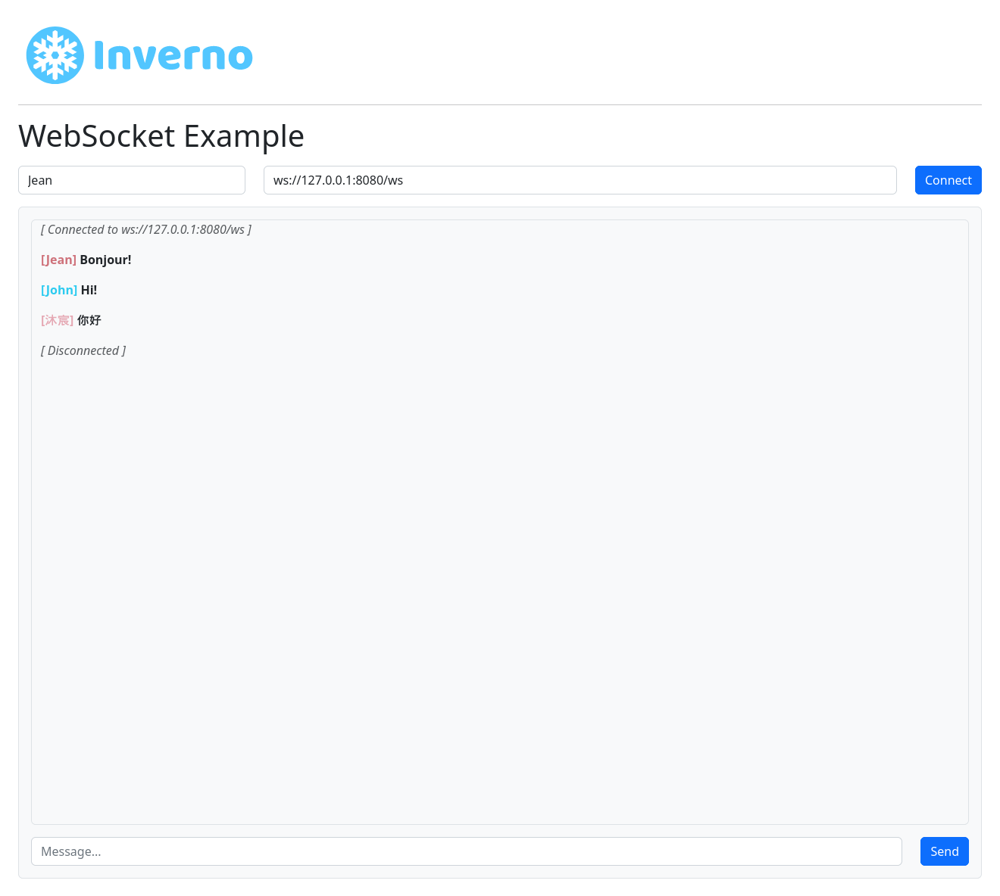

[inverno-mod-http-server]: https://github.com/inverno-io/inverno-mods/blob/master/inverno-http-server/
[inverno-mod-web-server]: https://github.com/inverno-io/inverno-mods/blob/master/inverno-web-server/
[inverno-dist-root]: https://github.com/inverno-io/inverno-dist
[inverno-core-root-doc]: https://github.com/inverno-io/inverno-core/blob/master/doc/reference-guide.md
[inverno-tool-maven-plugin]: https://github.com/inverno-io/inverno-tools/blob/master/inverno-maven-plugin
[inverno-javadoc]: https://inverno.io/docs/release/api/index.html

[epoll]: https://en.wikipedia.org/wiki/Epoll

[graalvm]: https://www.graalvm.org/
[logback]: https://logback.qos.ch/

# Inverno Web server WebSocket example

A sample Inverno application showing how to use the Web server module to create a WebSocket server.

The Web server configuration is exposed in the module's configuration `AppConfiguration`. The configuration in `src/main/resources/configuration.cprops` defines the `https` profile which can be activated to start the server with TLS support. The HTTP server is configured to use [epoll][epoll] when available (i.e. on Linux platform) for better performance.

The application exposes static resources under `web-root` folder at the root path and two identical WebSocket endpoints under `/ws` and `/controller/ws`. The first is defined programmatically in `AppWebServerConfigurer` whereas the second is defined in a declarative way in `AppWebController`.

The Maven build descriptor also defines three build profiles:

- `release` which builds a native application image in a `zip` archive.
- `release-image` which builds a Docker container image of the application in a `tar` archive.
- `install-image` which installs the Docker container image of the application to a local docker daemon.

## Running the application

The application is started using the Inverno Maven plugin as follows:

```plaintext
$ mvn inverno:run
...
2024-09-17 17:38:24,558 INFO  [main] i.i.m.h.s.i.HttpServer - HTTP Server (epoll) listening on http://0.0.0.0:8080
2024-09-17 17:38:24,559 INFO  [main] i.i.m.h.s.Server - Module io.inverno.mod.http.server started in 53ms
2024-09-17 17:38:24,559 INFO  [main] i.i.m.w.s.Server - Module io.inverno.mod.web.server started in 53ms
2024-09-17 17:38:24,621 INFO  [main] i.i.e.a.App_web_server_websocket - Module io.inverno.example.app_web_server_websocket started in 411ms
2024-09-17 17:38:24,622 INFO  [main] i.i.c.v.Application - Application io.inverno.example.app_web_server_websocket started in 466ms
```

TLS can be enabled by activating the `https` configuration:

```plaintext
$ mvn inverno:run -Dinverno.run.arguments="--profile=\\\"https\\\""
...
2024-09-17 17:40:29,773 INFO  [main] i.i.m.h.s.i.HttpServer - HTTP Server (epoll) listening on https://0.0.0.0:8443
2024-09-17 17:40:29,773 INFO  [main] i.i.m.h.s.Server - Module io.inverno.mod.http.server started in 604ms
2024-09-17 17:40:29,773 INFO  [main] i.i.m.w.s.Server - Module io.inverno.mod.web.server started in 605ms
2024-09-17 17:40:29,832 INFO  [main] i.i.e.a.App_web_server_websocket - Module io.inverno.example.app_web_server_websocket started in 974ms
2024-09-17 17:40:29,832 INFO  [main] i.i.c.v.Application - Application io.inverno.example.app_web_server_websocket started in 1034ms
```

The application is accessible at the following location: http://127.0.0.1:8080, it shows a simplistic chat application backed by a WebSocket:



## Packaging the application

The application can be packaged as a native runtime image by invoking the `release` build profile:

```plaintext
$ mvn install -Prelease
...
[INFO] --- inverno:${VERSION_INVERNO_TOOLS}:package-app (inverno-package-app) @ inverno-example-web-server-websocket ---
 [═══════════════════════════════════════════════ 100 % ══════════════════════════════════════════════] Project application archives created: zip
[INFO] 
[INFO] --- install:3.1.1:install (default-install) @ inverno-example-web-server-websocket ---
[INFO] Installing /home/jkuhn/Devel/git/winter/inverno-examples/inverno-example-web-server-websocket/pom.xml to /home/jkuhn/.m2/repository/io/inverno/example/inverno-example-web-server-websocket/1.0.0-SNAPSHOT/inverno-example-web-server-websocket-1.0.0-SNAPSHOT.pom
[INFO] Installing /home/jkuhn/Devel/git/winter/inverno-examples/inverno-example-web-server-websocket/target/inverno-example-web-server-websocket-1.0.0-SNAPSHOT.jar to /home/jkuhn/.m2/repository/io/inverno/example/inverno-example-web-server-websocket/1.0.0-SNAPSHOT/inverno-example-web-server-websocket-1.0.0-SNAPSHOT.jar
[INFO] Installing /home/jkuhn/Devel/git/winter/inverno-examples/inverno-example-web-server-websocket/target/inverno-example-web-server-websocket-1.0.0-SNAPSHOT-application_linux_amd64.zip to /home/jkuhn/.m2/repository/io/inverno/example/inverno-example-web-server-websocket/1.0.0-SNAPSHOT/inverno-example-web-server-websocket-1.0.0-SNAPSHOT-application_linux_amd64.zip
[INFO] ------------------------------------------------------------------------
[INFO] BUILD SUCCESS
[INFO] ------------------------------------------------------------------------
```

The previous command creates folder `target/inverno-example-web-server-websocket-1.0.0-SNAPSHOT-application_linux_amd64` containing the Java runtime and the application and installed the corresponding archive to the Maven repository:

```plaintext
$ ./target/inverno-example-web-server-websocket-1.0.0-SNAPSHOT-application_linux_amd64/bin/example-web-server-websocket
...
```

A portable docker image of the application can be created as a `tar` archive by invoking the `release-image` build profile:

```plaintext
$ mvn install -Prelease-image
...
[INFO] --- inverno:${VERSION_INVERNO_TOOLS}:package-image (inverno-release-image) @ inverno-example-web-server-websocket ---
 [═══════════════════════════════════════════════ 100 % ══════════════════════════════════════════════] Project Docker container image TAR archive created
[INFO] 
[INFO] --- install:3.1.1:install (default-install) @ inverno-example-web-server-websocket ---
[INFO] Installing /home/jkuhn/Devel/git/winter/inverno-examples/inverno-example-web-server-websocket/pom.xml to /home/jkuhn/.m2/repository/io/inverno/example/inverno-example-web-server-websocket/1.0.0-SNAPSHOT/inverno-example-web-server-websocket-1.0.0-SNAPSHOT.pom
[INFO] Installing /home/jkuhn/Devel/git/winter/inverno-examples/inverno-example-web-server-websocket/target/inverno-example-web-server-websocket-1.0.0-SNAPSHOT.jar to /home/jkuhn/.m2/repository/io/inverno/example/inverno-example-web-server-websocket/1.0.0-SNAPSHOT/inverno-example-web-server-websocket-1.0.0-SNAPSHOT.jar
[INFO] Installing /home/jkuhn/Devel/git/winter/inverno-examples/inverno-example-web-server-websocket/target/inverno-example-web-server-websocket-1.0.0-SNAPSHOT-container_linux_amd64.tar to /home/jkuhn/.m2/repository/io/inverno/example/inverno-example-web-server-websocket/1.0.0-SNAPSHOT/inverno-example-web-server-websocket-1.0.0-SNAPSHOT-container_linux_amd64.tar
[INFO] ------------------------------------------------------------------------
[INFO] BUILD SUCCESS
[INFO] ------------------------------------------------------------------------
```

The previous command should create archive `target/inverno-example-web-server-websocket-1.0.0-SNAPSHOT-container_linux_amd64.tar` docker image that can be loaded into docker as follows:

```plaintext
$ docker load --input target/inverno-example-web-server-websocket-1.0.0-SNAPSHOT-container_linux_amd64.tar
```

The application can be directly deployed to a local docker daemon by invoking the `install-image` build profile:

```plaintext
$ mvn install -Pinstall-image
...
[INFO] --- inverno:${VERSION_INVERNO_TOOLS}:install-image (inverno-install-image) @ inverno-example-web-server-websocket ---
 [═══════════════════════════════════════════════ 100 % ══════════════════════════════════════════════] Project Docker container image deployed to Docker daemon
[INFO] Project image inverno-example-web-server-websocket:1.0.0-SNAPSHOT installed to Docker
[INFO] ------------------------------------------------------------------------
[INFO] BUILD SUCCESS
[INFO] ------------------------------------------------------------------------
```

The application can then be started in docker as follows:

```plaintext
$ docker run --rm --network host inverno-example-web-server-websocket:1.0.0-SNAPSHOT 
...
2024-04-09 13:36:37,217 INFO  [main] i.i.m.h.s.i.HttpServer - HTTP Server (epoll) listening on http://0.0.0.0:8080
2024-04-09 13:36:37,218 INFO  [main] i.i.m.h.s.Server - Module io.inverno.mod.http.server started in 93ms
2024-04-09 13:36:37,218 INFO  [main] i.i.m.w.s.Server - Module io.inverno.mod.web.server started in 93ms
2024-04-09 13:36:37,218 INFO  [main] i.i.e.a.App_web_websocket - Module io.inverno.example.app_web_websocket started in 327ms
2024-04-09 13:36:37,219 INFO  [main] i.i.c.v.Application - Application io.inverno.example.app_web_websocket started in 385ms
```

## Building a native image

Using [GraalVM][graalvm], you can also build a native image of the application with the following command:

```plaintext
> mvn clean package -Pnative
```

You can then run the native application:

```plaintext
> ./target/inverno-example-web-socket
2024-04-09 15:42:25,113 INFO  [main] i.i.c.v.Application - Inverno is starting...


     ╔════════════════════════════════════════════════════════════════════════════════════════════╗
     ║                      , ~~ ,                                                                ║
     ║                  , '   /\   ' ,                                                            ║
     ║                 , __   \/   __ ,      _                                                    ║
     ║                ,  \_\_\/\/_/_/  ,    | |  ___  _    _  ___   __  ___   ___                 ║
     ║                ,    _\_\/_/_    ,    | | / _ \\ \  / // _ \ / _|/ _ \ / _ \                ║
     ║                ,   __\_/\_\__   ,    | || | | |\ \/ /|  __/| | | | | | |_| |               ║
     ║                 , /_/ /\/\ \_\ ,     |_||_| |_| \__/  \___||_| |_| |_|\___/                ║
     ║                  ,     /\     ,                                                            ║
     ║                    ,   \/   ,                                   << n/a >>                  ║
     ║                      ' -- '                                                                ║
     ╠════════════════════════════════════════════════════════════════════════════════════════════╣
     ║ Java runtime        : GraalVM Runtime Environment                                          ║
     ║ Java version        : 21.0.2+13-LTS-jvmci-23.1-b30                                         ║
     ║ Java home           :                                                                      ║
     ╚════════════════════════════════════════════════════════════════════════════════════════════╝


2024-04-09 15:42:25,113 INFO  [main] i.i.e.a.App_web_websocket - Starting Module io.inverno.example.app_web_websocket...
2024-04-09 15:42:25,114 INFO  [main] i.i.m.b.Boot - Starting Module io.inverno.mod.boot...
2024-04-09 15:42:25,119 INFO  [main] i.i.m.b.Boot - Module io.inverno.mod.boot started in 5ms
2024-04-09 15:42:25,119 INFO  [main] i.i.m.w.s.Server - Starting Module io.inverno.mod.web.server...
2024-04-09 15:42:25,119 INFO  [main] i.i.m.h.s.Server - Starting Module io.inverno.mod.http.server...
2024-04-09 15:42:25,119 INFO  [main] i.i.m.h.b.Base - Starting Module io.inverno.mod.http.base...
2024-04-09 15:42:25,119 INFO  [main] i.i.m.h.b.Base - Module io.inverno.mod.http.base started in 0ms
2024-04-09 15:42:25,122 INFO  [main] i.i.m.h.s.i.HttpServer - HTTP Server (epoll) listening on http://0.0.0.0:8080
2024-04-09 15:42:25,122 INFO  [main] i.i.m.h.s.Server - Module io.inverno.mod.http.server started in 2ms
2024-04-09 15:42:25,122 INFO  [main] i.i.m.w.s.Server - Module io.inverno.mod.web.server started in 2ms
2024-04-09 15:42:25,122 INFO  [main] i.i.e.a.App_web_websocket - Module io.inverno.example.app_web_websocket started in 8ms
2024-04-09 15:42:25,122 INFO  [main] i.i.c.v.Application - Application io.inverno.example.app_web_websocket started in 8ms
```

> Note that for the native image to work, [logback][logback] must be used as logging manager since log4j doesn't support native build (see https://issues.apache.org/jira/browse/LOG4J2-2649).

## Going further

- [HTTP server module documentation][inverno-mod-http-server]
- [Web server module documentation][inverno-mod-web-server]
- [Inverno distribution documentation][inverno-dist-root]
- [Inverno Maven plugin documentation][inverno-tool-maven-plugin]
- [Inverno core documentation][inverno-core-root-doc]
- [API documentation][inverno-javadoc]
