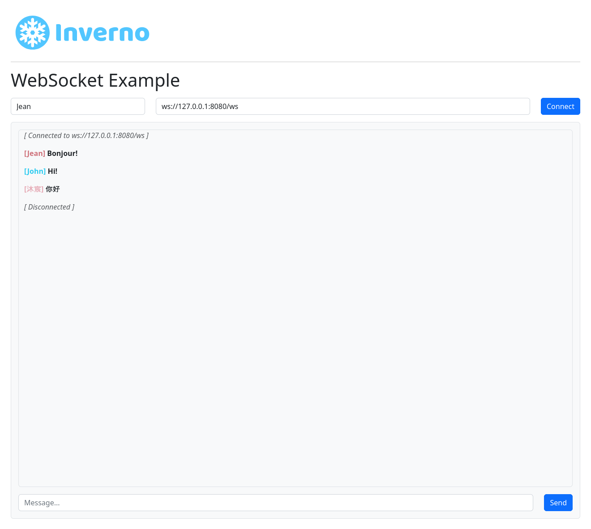

[inverno-mod-http-server]: https://github.com/inverno-io/inverno-mods/blob/master/doc/reference-guide.md#http-server
[inverno-mod-web]: https://github.com/inverno-io/inverno-mods/blob/master/doc/reference-guide.md#web
[inverno-dist-root]: https://github.com/inverno-io/inverno-dist
[inverno-core-root-doc]: https://github.com/inverno-io/inverno-core/blob/master/doc/reference-guide.md
[inverno-tool-maven-plugin]: https://github.com/inverno-io/inverno-tools/blob/master/inverno-maven-plugin
[inverno-javadoc]: https://inverno.io/docs/release/api/index.html

[epoll]: https://en.wikipedia.org/wiki/Epoll

[graalvm]: https://www.graalvm.org/

# Inverno Web server WebSocket example

A sample Inverno application showing how to use the Web server module to create a WebSocket server.

The Web server configuration is exposed in the module's configuration `App_web_websocketConfiguration`. The configuration in `src/main/resources/configuration.cprops` defines the `https` profile which can be activated to start the server with TLS support. The HTTP server is configured to use [epoll][epoll] when available (ie. on Linux platform) for better performance.

The application exposes static resources under `web-root` folder at the root path and two identical WebSocket endpoints under `/ws` and `/controller/ws`. The first is defined programmatically in `App_web_websocketRoutesConfigurer` whereas the second is defined in a declarative way in `App_web_websocketWebController`.

The Maven build descriptor also defines three build profiles:

- `release` which builds a native application image in a `zip` archive, a docker image in a `tar` archive and installs the docker image of the application in a local docker daemon.
- `release-docker` which builds a docker image in a `tar` archive
- `install-docker` which installs the docker image of the application to a local docker daemon.

## Running the example

The application is started using the Inverno Maven plugin as follows:

```plaintext
$ mvn clean inverno:run
...
2022-07-07 16:03:00,533 INFO  [main] i.i.m.h.s.i.HttpServer - HTTP Server (nio) listening on http://0.0.0.0:8080
2022-07-07 16:03:00,534 INFO  [main] i.i.m.h.s.Server - Module io.inverno.mod.http.server started in 106ms
2022-07-07 16:03:00,534 INFO  [main] i.i.m.w.Web - Module io.inverno.mod.web started in 106ms
2022-07-07 16:03:00,534 INFO  [main] i.i.e.a.App_web_websocket - Module io.inverno.example.app_web_websocket started in 365ms
2022-07-07 16:03:00,537 INFO  [main] i.i.c.v.Application - Application io.inverno.example.app_web_websocket started in 424ms
```

TLS can be enabled by activating the `https` configuration:

```plaintext
$ mvn inverno:run -Dinverno.run.arguments="--profile=\\\"https\\\""
...
2022-07-07 16:08:49,862 INFO  [main] i.i.m.h.s.i.HttpServer - HTTP Server (nio) listening on https://0.0.0.0:8443
2022-07-07 16:08:49,862 INFO  [main] i.i.m.h.s.Server - Module io.inverno.mod.http.server started in 422ms
2022-07-07 16:08:49,862 INFO  [main] i.i.m.w.Web - Module io.inverno.mod.web started in 422ms
2022-07-07 16:08:49,862 INFO  [main] i.i.e.a.App_web_websocket - Module io.inverno.example.app_web_websocket started in 657ms
2022-07-07 16:08:49,866 INFO  [main] i.i.c.v.Application - Application io.inverno.example.app_web_websocket started in 716ms
```

The application is accessible at the following location: http://127.0.0.1:8080, it shows a simplistic chat application backed by a WebSocket:



## Packaging the example

The application can be packaged as a native runtime image by invoking the `release` build profile:

```plaintext
$ mvn install -Prelease
...
[INFO] --- inverno-maven-plugin:${VERSION_INVERNO_TOOLS}:build-app (inverno-build-app) @ inverno-example-web ---
[INFO] Building application image: /home/jkuhn/Devel/git/winter/inverno-examples/inverno-example-web-websocket/target/maven-inverno/application_linux_amd64/inverno-example-web-socket-1.0.0-SNAPSHOT...
 [═══════════════════════════════════════════════ 100 % ══════════════════════════════════════════════] 
[INFO] 
[INFO] --- maven-install-plugin:2.5.2:install (default-install) @ inverno-example-web-socket ---
[INFO] Installing /home/jkuhn/Devel/git/winter/inverno-examples/inverno-example-web-websocket/target/inverno-example-web-socket-1.0.0-SNAPSHOT.jar to /home/jkuhn/.m2/repository/io/inverno/example/inverno-example-web-socket/1.0.0-SNAPSHOT/inverno-example-web-socket-1.0.0-SNAPSHOT.jar
[INFO] Installing /home/jkuhn/Devel/git/winter/inverno-examples/inverno-example-web-websocket/pom.xml to /home/jkuhn/.m2/repository/io/inverno/example/inverno-example-web-socket/1.0.0-SNAPSHOT/inverno-example-web-socket-1.0.0-SNAPSHOT.pom
[INFO] Installing /home/jkuhn/Devel/git/winter/inverno-examples/inverno-example-web-websocket/target/inverno-example-web-socket-1.0.0-SNAPSHOT-application_linux_amd64.zip to /home/jkuhn/.m2/repository/io/inverno/example/inverno-example-web-socket/1.0.0-SNAPSHOT/inverno-example-web-socket-1.0.0-SNAPSHOT-application_linux_amd64.zip
[INFO] ------------------------------------------------------------------------
[INFO] BUILD SUCCESS
[INFO] ------------------------------------------------------------------------
[INFO] Total time:  19.864 s
[INFO] Finished at: 2022-07-07T16:16:18+02:00
[INFO] ------------------------------------------------------------------------
```

The previous command should create archive `target/inverno-example-web-1.0.0-SNAPSHOT-application_linux_amd64.zip` containing the application and the Java runtime to run it:

```plaintext
$ unzip inverno-example-web-websocket-1.0.0-SNAPSHOT-application_linux_amd64.zip
$ ./inverno-example-web-websocket-1.0.0-SNAPSHOT/bin/example-web
...
```

A portable docker image of the application can be created as a `tar` archive by invoking the `release-docker` build profile:

```plaintext
$ mvn install -Prelease-docker
...
[INFO] --- inverno-maven-plugin:${VERSION_INVERNO_TOOLS}:build-image-tar (inverno-build-image-docker) @ inverno-example-web ---
[INFO] Building project container image...
 [═══════════════════════════════════════════════ 100 % ══════════════════════════════════════════════] 
[INFO] 
[INFO] --- maven-install-plugin:2.5.2:install (default-install) @ inverno-example-web ---
[INFO] Installing /home/jkuhn/Devel/git/frmk/inverno/inverno-examples/inverno-example-web-websocket/target/inverno-example-web-websocket-1.0.0-SNAPSHOT.jar to /home/jkuhn/.m2/repository/io/inverno/example/inverno-example-web-websocket/1.0.0-SNAPSHOT/inverno-example-web-websocket-1.0.0-SNAPSHOT.jar
[INFO] Installing /home/jkuhn/Devel/git/frmk/inverno/inverno-examples/inverno-example-web-websocket/pom.xml to /home/jkuhn/.m2/repository/io/inverno/example/inverno-example-web-websocket/1.0.0-SNAPSHOT/inverno-example-web-websocket-1.0.0-SNAPSHOT.pom
[INFO] Installing /home/jkuhn/Devel/git/frmk/inverno/inverno-examples/inverno-example-web-websocket/target/inverno-example-web-websocket-1.0.0-SNAPSHOT-container_linux_amd64.tar to /home/jkuhn/.m2/repository/io/inverno/example/inverno-example-web-websocket/1.0.0-SNAPSHOT/inverno-example-web-websocket-1.0.0-SNAPSHOT-container_linux_amd64.tar
[INFO] ------------------------------------------------------------------------
[INFO] BUILD SUCCESS
[INFO] ------------------------------------------------------------------------
[INFO] Total time:  19.606 s
[INFO] Finished at: 2021-04-26T14:38:43+02:00
[INFO] ------------------------------------------------------------------------
```

The previous command should create archive `target/inverno-example-web-websocket-1.0.0-SNAPSHOT-container_linux_amd64.tar` docker image that can be loaded into docker as follows:

```plaintext
$ docker load --input target/inverno-example-web-websocket-1.0.0-SNAPSHOT-container_linux_amd64.tar
```

The application can be directly deployed to a local docker daemon by invoking the `install-docker` build profile:

```plaintext
$ mvn install -Pinstall-docker
...
[INFO] --- inverno-maven-plugin:${VERSION_INVERNO_TOOLS}:build-image-docker (inverno-build-image-docker) @ inverno-example-web ---
[INFO] Building project container image...
 [═══════════════════════════════════════════════ 100 % ══════════════════════════════════════════════] 
[INFO] ------------------------------------------------------------------------
[INFO] BUILD SUCCESS
[INFO] ------------------------------------------------------------------------
[INFO] Total time:  21.070 s
[INFO] Finished at: 2021-04-26T14:43:42+02:00
[INFO] ------------------------------------------------------------------------
```

The application can then be started in docker as follows:

```plaintext
$ docker run --rm --network host -e LANG=C.UTF-8 inverno-example-web-websocket:1.0.0-SNAPSHOT 
...
2021-04-26 12:46:34,284 INFO  [main] i.w.m.h.s.i.HttpServer - HTTP Server (epoll) listening on http://0.0.0.0:8080
2021-04-26 12:46:34,285 INFO  [main] i.w.m.h.s.Server - Module io.inverno.mod.http.server started in 88ms
2021-04-26 12:46:34,285 INFO  [main] i.w.m.w.Web - Module io.inverno.mod.web started in 88ms
2021-04-26 12:46:34,285 INFO  [main] i.w.e.a.App_web - Module io.inverno.example.app_web_websocket started in 281ms
```

## Building a native image

Using [GraalVM][graalvm], you can also build a native image of the application with the following command:

```plaintext
> mvn clean package -Pnative
```

You can then run the native application:

```plaintext
> ./target/inverno-example-web-socket
2022-07-07 16:14:03,258 INFO  [main] i.i.c.v.Application - Inverno is starting...


     ╔════════════════════════════════════════════════════════════════════════════════════════════╗
     ║                      , ~~ ,                                                                ║
     ║                  , '   /\   ' ,                                                            ║
     ║                 , __   \/   __ ,      _                                                    ║
     ║                ,  \_\_\/\/_/_/  ,    | |  ___  _    _  ___   __  ___   ___                 ║
     ║                ,    _\_\/_/_    ,    | | / _ \\ \  / // _ \ / _|/ _ \ / _ \                ║
     ║                ,   __\_/\_\__   ,    | || | | |\ \/ /|  __/| | | | | | |_| |               ║
     ║                 , /_/ /\/\ \_\ ,     |_||_| |_| \__/  \___||_| |_| |_|\___/                ║
     ║                  ,     /\     ,                                                            ║
     ║                    ,   \/   ,                                   << n/a >>                  ║
     ║                      ' -- '                                                                ║
     ╠════════════════════════════════════════════════════════════════════════════════════════════╣
     ║ Java runtime        :                                                                      ║
     ║ Java version        :                                                                      ║
     ║ Java home           :                                                                      ║
     ╚════════════════════════════════════════════════════════════════════════════════════════════╝


2022-07-07 16:14:03,258 INFO  [main] i.i.e.a.App_web_websocket - Starting Module io.inverno.example.app_web_websocket...
2022-07-07 16:14:03,258 INFO  [main] i.i.m.b.Boot - Starting Module io.inverno.mod.boot...
2022-07-07 16:14:03,262 INFO  [main] i.i.m.b.Boot - Module io.inverno.mod.boot started in 3ms
2022-07-07 16:14:03,262 INFO  [main] i.i.m.w.Web - Starting Module io.inverno.mod.web...
2022-07-07 16:14:03,262 INFO  [main] i.i.m.h.s.Server - Starting Module io.inverno.mod.http.server...
2022-07-07 16:14:03,262 INFO  [main] i.i.m.h.b.Base - Starting Module io.inverno.mod.http.base...
2022-07-07 16:14:03,262 INFO  [main] i.i.m.h.b.Base - Module io.inverno.mod.http.base started in 0ms
2022-07-07 16:14:03,263 INFO  [main] i.i.m.h.s.i.HttpServer - HTTP Server (nio) listening on http://0.0.0.0:8080
2022-07-07 16:14:03,263 INFO  [main] i.i.m.h.s.Server - Module io.inverno.mod.http.server started in 1ms
2022-07-07 16:14:03,263 INFO  [main] i.i.m.w.Web - Module io.inverno.mod.web started in 1ms
2022-07-07 16:14:03,263 INFO  [main] i.i.e.a.App_web_websocket - Module io.inverno.example.app_web_websocket started in 5ms
2022-07-07 16:14:03,263 INFO  [main] i.i.c.v.Application - Application io.inverno.example.app_web_websocket started in 5ms
```

> This application uses Jackson annotation for JSON serialization/deserialization which seems to require further configuration for it to work properly.

> If the server is started without TLS the startup time is drastically reduced and goes below 10ms. However native transport is not supported in native image which has a significant impact on performances.

## Going further

- [HTTP server module documentation][inverno-mod-http-server]
- [Web server module documentation][inverno-mod-web]
- [Inverno distribution documentation][inverno-dist-root]
- [Inverno Maven plugin documentation][inverno-tool-maven-plugin]
- [Inverno core documentation][inverno-core-root-doc]
- [API documentation][inverno-javadoc]