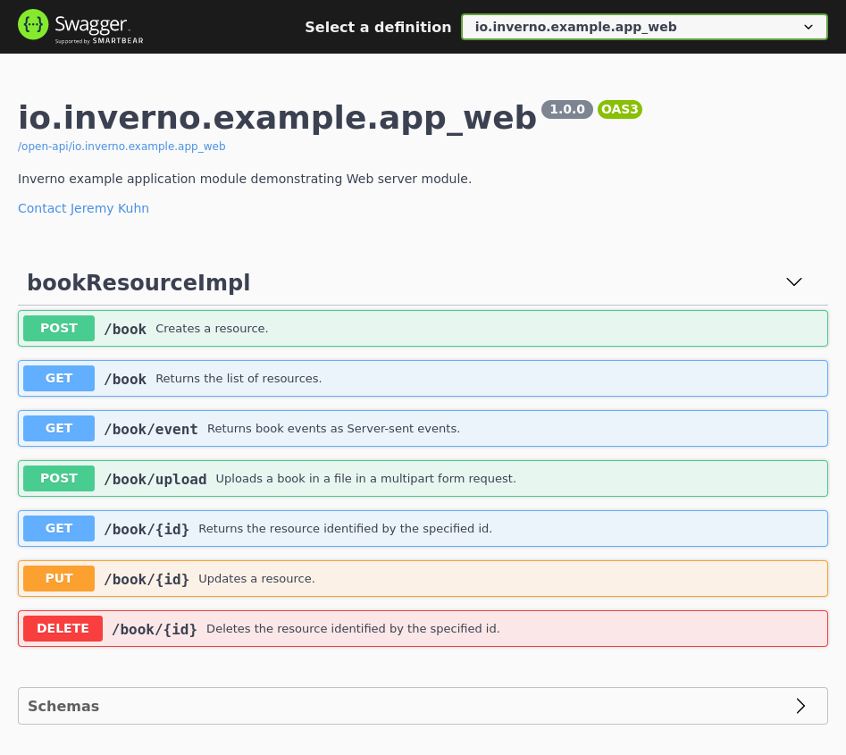

[inverno-mod-http-server]: https://github.com/inverno-io/inverno-mods/blob/master/inverno-http-server/
[inverno-mod-web-server]: https://github.com/inverno-io/inverno-mods/blob/master/inverno-web-server/
[inverno-dist-root]: https://github.com/inverno-io/inverno-dist
[inverno-core-root-doc]: https://github.com/inverno-io/inverno-core/blob/master/doc/reference-guide.md
[inverno-tool-maven-plugin]: https://github.com/inverno-io/inverno-tools/blob/master/inverno-maven-plugin
[inverno-javadoc]: https://inverno.io/docs/release/api/index.html

[epoll]: https://en.wikipedia.org/wiki/Epoll
[chunked-transfer-encoding]: https://en.wikipedia.org/wiki/Chunked_transfer_encoding
[swagger-ui]: https://swagger.io/tools/swagger-ui/
[open-api]: https://www.openapis.org/

[graalvm]: https://www.graalvm.org/
[logback]: https://logback.qos.ch/

# Inverno Web server example

A sample Inverno application showing how to use the Web server module to create efficient and performant HTTP/1.x and HTTP/2 servers with Web enabled features like request routing, content negociation, automatic payload conversion, static content, WebJars, automatic Open API specifications in SwaggerUI...

The Web server configuration is exposed in the module's configuration `App_webConfiguration`. The configuration in `src/main/resources/configuration.cprops` defines the `https` profile which can be activated to start the server with TLS support. The HTTP server is configured to use [epoll][epoll] when available (ie. on Linux platform) for better performance.

The application defines the `BookResource` Web controller which exposes basic CRUD operations on books as REST resource. The `BookResourceImpl` implementation also demonstrates how to create a server-sent events endpoint or upload files in a `multipart/form-data` request.

An additional Web router configurer `App_webWebRouterConfigurer` shows how to *manually* declare a route serving static resources from local file system or any resource location and how to define routes using content negotiation based on accepted language.

A custom Error Web router `App_webErrorWebRouterConfigurer` is also provided to show how to create custom exception handlers.

Open API specification generation is activated and resulting specifications exposed by the server which also include the Swagger UI to display them.

The Maven build descriptor also defines three build profiles:

- `release` which builds a native application image in a `zip` archive.
- `release-image` which builds a Docker container image of the application in a `tar` archive.
- `install-image` which installs the Docker container image of the application to a local docker daemon.

## Running the application

The application is started using the Inverno Maven plugin as follows:

```plaintext
$ mvn inverno:run
...
2021-04-26 10:54:45,020 INFO  [main] i.w.m.h.s.i.HttpServer - HTTP Server (epoll) listening on http://0.0.0.0:8080
2021-04-26 10:54:45,020 INFO  [main] i.w.m.h.s.Server - Module io.inverno.mod.http.server started in 84ms
2021-04-26 10:54:45,020 INFO  [main] i.w.m.w.Web - Module io.inverno.mod.web.server started in 84ms
2021-04-26 10:54:45,021 INFO  [main] i.w.e.a.App_web - Module io.inverno.example.app_web started in 288ms
```

TLS can be enabled by activating the `https` configuration:

```plaintext
$ mvn inverno:run -Dinverno.run.arguments="--profile=\\\"https\\\""
...
2021-04-26 10:56:20,975 INFO  [main] i.w.m.h.s.i.HttpServer - HTTP Server (epoll) listening on https://0.0.0.0:8443
2021-04-26 10:56:20,975 INFO  [main] i.w.m.h.s.Server - Module io.inverno.mod.http.server started in 377ms
2021-04-26 10:56:20,976 INFO  [main] i.w.m.w.Web - Module io.inverno.mod.web.server started in 377ms
2021-04-26 10:56:20,976 INFO  [main] i.w.e.a.App_web - Module io.inverno.example.app_web started in 585ms
```

We can then test the application starting with CRUD operations on book REST resource:

```plaintext
$ curl -i -X POST -H 'content-type: application/json' -d '{"isbn":"978-0132143011","title":"Distributed Systems: Concepts and Design","author":"George Coulouris, Jean Dollimore, Tim Kindberg, Gordon Blair","pages":1080}' http://127.0.0.1:8080/book
HTTP/1.1 201 Created
location: /book/978-0132143011
content-length: 0
```
```plaintext
$ curl -i http://127.0.0.1:8080/book
HTTP/1.1 200 OK
content-type: application/json
transfer-encoding: chunked

[{"isbn":"978-0132143011","title":"Distributed Systems: Concepts and Design","author":"George Coulouris, Jean Dollimore, Tim Kindberg, Gordon Blair","pages":1080}]
```
```plaintext
$ curl -i http://127.0.0.1:8080/book/978-0132143011
HTTP/1.1 200 OK
content-type: application/json
content-length: 161

{"isbn":"978-0132143011","title":"Distributed Systems: Concepts and Design","author":"George Coulouris, Jean Dollimore, Tim Kindberg, Gordon Blair","pages":1080}
```
```plaintext
$ curl -i -X DELETE http://127.0.0.1:8080/book/978-0132143011
HTTP/1.1 200 OK
content-length: 0

```
```plaintext
$ curl -i http://127.0.0.1:8080/book
HTTP/1.1 200 OK
content-type: application/json
transfer-encoding: chunked

[]
```

A book stored in a file (eg. `src/test/resources/book.json`) can be uploaded as follows:

```plaintext
$ curl -iv -Fbook="@src/test/resources/book.json;type=application/json"  http://localhost:8080/book/upload
HTTP/1.1 200 OK
content-type: application/json
transfer-encoding: chunked

[{"message":"Book 978-0132143011 has been stored."}]
```

Book related Server-sent events can be polled as follows:

```plaintext
$ curl -i http://localhost:8080/book/event
HTTP/1.1 200 OK
content-type: text/event-stream;charset=utf-8
transfer-encoding: chunked

1a
id:0
event:bookEvent
data:
21
{"message":"some book event\r\n"}
4


1a
id:1
event:bookEvent
data:
21
{"message":"some book event\r\n"}
4

...
```

With previous command, the server responded with a [chunked transfer encoding][chunked-transfer-encoding] using HTTP/1.x, we could also have queried the server using HTTP/2 over cleartext as follows to produce a better looking response:

```plaintext
$ curl -i --http2 http://localhost:8080/book/event
HTTP/1.1 101 Switching Protocols
connection: upgrade
upgrade: h2c

HTTP/2 200 
content-type: text/event-stream;charset=utf-8

id:0
event:bookEvent
data:{"message":"some book event\r\n"}

id:1
event:bookEvent
data:{"message":"some book event\r\n"}

...
```

The [Swagger UI][swagger-ui] exposing generated [OpenAPI][open-api] specifications is available at `http://127.0.0.1:8080/open-api/`:



Static resources under `web-root/` can be accessed at `http://127.0.0.1:8080/static/`:

```plaintext
$ curl -i http://localhost:8080/static/
HTTP/1.1 200 OK
content-length: 379
content-type: text/html

<!DOCTYPE html>
<html>
<head>
<meta charset="UTF-8">
<title>Inverno Web example</title>
</head>
<body style="min-width:20em; max-width: 100em; margin: 3em auto;font-family:'Open Sans', Consolas, Helvetica, sans-serif;">

<hr/>
<p>This is a sample static resource served with the Inverno Web server.</p>
<hr/>
</body>
</html>
```

The `/hello` route is exposed in different languages, content negotiation can be tested by specifying an `accept-language` header:

```plaintext
$ curl -i http://localhost:8080/hello
HTTP/1.1 200 OK
content-type: text/plain
content-length: 8

Saluton!
```
```plaintext
$ curl -i -H 'accept-language: en' http://localhost:8080/hello
HTTP/1.1 200 OK
content-type: text/plain
content-length: 8

Hello!
```
```plaintext
$ curl -i -H 'accept-language: fr' http://localhost:8080/hello
HTTP/1.1 200 OK
content-type: text/plain
content-length: 31

L'intercepteur te dit: Bonjour!
```
```plaintext
$ curl -i -H 'accept-language: it-IT' http://localhost:8080/hello
HTTP/1.1 200 OK
content-type: text/plain
content-length: 8

Saluton!
```

## Packaging the application

The application can be packaged as a native runtime image by invoking the `release` build profile:

```plaintext
$ mvn install -Prelease
...
[INFO] --- inverno:${VERSION_INVERNO_TOOLS}:package-app (inverno-package-app) @ inverno-example-web ---
 [═══════════════════════════════════════════════ 100 % ══════════════════════════════════════════════] 
[INFO] 
[INFO] --- maven-install-plugin:2.5.2:install (default-install) @ inverno-example-web ---
[INFO] Installing /home/jkuhn/Devel/git/frmk/inverno/inverno-examples/inverno-example-web/target/inverno-example-web-1.0.0-SNAPSHOT.jar to /home/jkuhn/.m2/repository/io/inverno/example/inverno-example-web/1.0.0-SNAPSHOT/inverno-example-web-1.0.0-SNAPSHOT.jar
[INFO] Installing /home/jkuhn/Devel/git/frmk/inverno/inverno-examples/inverno-example-web/pom.xml to /home/jkuhn/.m2/repository/io/inverno/example/inverno-example-web/1.0.0-SNAPSHOT/inverno-example-web-1.0.0-SNAPSHOT.pom
[INFO] Installing /home/jkuhn/Devel/git/frmk/inverno/inverno-examples/inverno-example-web/target/inverno-example-web-1.0.0-SNAPSHOT-application_linux_amd64.zip to /home/jkuhn/.m2/repository/io/inverno/example/inverno-example-web/1.0.0-SNAPSHOT/inverno-example-web-1.0.0-SNAPSHOT-application_linux_amd64.zip
[INFO] ------------------------------------------------------------------------
[INFO] BUILD SUCCESS
[INFO] ------------------------------------------------------------------------
```

The previous command creates folder `target/inverno-example-web-1.0.0-SNAPSHOT-application_linux_amd64` containing the Java runtime and the application and installed the corresponding archive to the Maven repository:

```plaintext
$ ./target/inverno-example-web-1.0.0-SNAPSHOT-application_linux_amd64/bin/example-web
...
```

A portable docker image of the application can be created as a `tar` archive by invoking the `release-image` build profile:

```plaintext
$ mvn install -Prelease-image
...
[INFO] --- inverno:${VERSION_INVERNO_TOOLS}:package-image (inverno-package-image) @ inverno-example-web ---
 [═══════════════════════════════════════════════ 100 % ══════════════════════════════════════════════] Project Docker container image TAR archive created
[INFO] 
[INFO] --- install:3.1.1:install (default-install) @ inverno-example-web ---
[INFO] Installing /home/jkuhn/Devel/git/frmk/inverno/inverno-examples/inverno-example-web/target/inverno-example-web-1.0.0-SNAPSHOT.jar to /home/jkuhn/.m2/repository/io/inverno/example/inverno-example-web/1.0.0-SNAPSHOT/inverno-example-web-1.0.0-SNAPSHOT.jar
[INFO] Installing /home/jkuhn/Devel/git/frmk/inverno/inverno-examples/inverno-example-web/pom.xml to /home/jkuhn/.m2/repository/io/inverno/example/inverno-example-web/1.0.0-SNAPSHOT/inverno-example-web-1.0.0-SNAPSHOT.pom
[INFO] Installing /home/jkuhn/Devel/git/frmk/inverno/inverno-examples/inverno-example-web/target/inverno-example-web-1.0.0-SNAPSHOT-container_linux_amd64.tar to /home/jkuhn/.m2/repository/io/inverno/example/inverno-example-web/1.0.0-SNAPSHOT/inverno-example-web-1.0.0-SNAPSHOT-container_linux_amd64.tar
[INFO] ------------------------------------------------------------------------
[INFO] BUILD SUCCESS
[INFO] ------------------------------------------------------------------------
```

The previous command creates archive `target/inverno-example-web-1.0.0-SNAPSHOT-container_linux_amd64.tar` docker image that can be loaded into docker as follows:

```plaintext
$ docker load --input target/inverno-example-web-1.0.0-SNAPSHOT-container_linux_amd64.tar
```

The application can be directly deployed to a local docker daemon by invoking the `install-image` build profile:

```plaintext
$ mvn install -Pinstall-image
...
[INFO] --- inverno:${VERSION_INVERNO_TOOLS}:install-image (inverno-install-image) @ inverno-example-web ---
 [═══════════════════════════════════════════════ 100 % ══════════════════════════════════════════════] Project Docker container image deployed to Docker daemon
[INFO] Project image inverno-example-web-server:1.0.0-SNAPSHOT installed to Docker
[INFO] ------------------------------------------------------------------------
[INFO] BUILD SUCCESS
[INFO] ------------------------------------------------------------------------
```

The application can then be started in docker as follows:

```plaintext
$ docker run --rm --network host inverno-example-web:1.0.0-SNAPSHOT 
...
2021-04-26 12:46:34,284 INFO  [main] i.w.m.h.s.i.HttpServer - HTTP Server (epoll) listening on http://0.0.0.0:8080
2021-04-26 12:46:34,285 INFO  [main] i.w.m.h.s.Server - Module io.inverno.mod.http.server started in 88ms
2021-04-26 12:46:34,285 INFO  [main] i.w.m.w.Web - Module io.inverno.mod.web.server started in 88ms
2021-04-26 12:46:34,285 INFO  [main] i.w.e.a.App_web - Module io.inverno.example.app_web started in 281ms
```

## Building a native image

Using [GraalVM][graalvm], you can also build a native image of the application with the following command:

```plaintext
> mvn clean package -Pnative
```

You can then run the native application:

```plaintext
> ./target/inverno-example-web
2024-04-09 11:36:24,492 INFO  [main] i.i.c.v.Application - Inverno is starting...


     ╔════════════════════════════════════════════════════════════════════════════════════════════╗
     ║                      , ~~ ,                                                                ║
     ║                  , '   /\   ' ,                                                            ║
     ║                 , __   \/   __ ,      _                                                    ║
     ║                ,  \_\_\/\/_/_/  ,    | |  ___  _    _  ___   __  ___   ___                 ║
     ║                ,    _\_\/_/_    ,    | | / _ \\ \  / // _ \ / _|/ _ \ / _ \                ║
     ║                ,   __\_/\_\__   ,    | || | | |\ \/ /|  __/| | | | | | |_| |               ║
     ║                 , /_/ /\/\ \_\ ,     |_||_| |_| \__/  \___||_| |_| |_|\___/                ║
     ║                  ,     /\     ,                                                            ║
     ║                    ,   \/   ,                                   << n/a >>                  ║
     ║                      ' -- '                                                                ║
     ╠════════════════════════════════════════════════════════════════════════════════════════════╣
     ║ Java runtime        : GraalVM Runtime Environment                                          ║
     ║ Java version        : 21.0.2+13-LTS-jvmci-23.1-b30                                         ║
     ║ Java home           :                                                                      ║
     ╚════════════════════════════════════════════════════════════════════════════════════════════╝


2024-04-09 11:36:24,492 INFO  [main] i.i.e.a.App_web - Starting Module io.inverno.example.app_web...
2024-04-09 11:36:24,492 INFO  [main] i.i.m.b.Boot - Starting Module io.inverno.mod.boot...
2024-04-09 11:36:24,499 INFO  [main] i.i.m.b.Boot - Module io.inverno.mod.boot started in 6ms
2024-04-09 11:36:24,499 INFO  [main] i.i.m.w.s.Server - Starting Module io.inverno.mod.web.server...
2024-04-09 11:36:24,499 INFO  [main] i.i.m.h.s.Server - Starting Module io.inverno.mod.http.server...
2024-04-09 11:36:24,499 INFO  [main] i.i.m.h.b.Base - Starting Module io.inverno.mod.http.base...
2024-04-09 11:36:24,499 INFO  [main] i.i.m.h.b.Base - Module io.inverno.mod.http.base started in 0ms
2024-04-09 11:36:24,500 WARN  [main] i.i.m.w.s.i.GenericWebRouteInterceptor - Ignoring interceptor {"method":"null","path":"/hello","consume":"null","produce":"null","language":"fr-FR} on route {"method":"GET","path":"/hello","consume":"null","produce":"text/plain","language":"null}: language is missing
2024-04-09 11:36:24,501 INFO  [main] i.i.m.h.s.i.HttpServer - HTTP Server (epoll) listening on http://0.0.0.0:8080
2024-04-09 11:36:24,501 INFO  [main] i.i.m.h.s.Server - Module io.inverno.mod.http.server started in 2ms
2024-04-09 11:36:24,501 INFO  [main] i.i.m.w.s.Server - Module io.inverno.mod.web.server started in 2ms
2024-04-09 11:36:24,501 INFO  [main] i.i.e.a.App_web - Module io.inverno.example.app_web started in 9ms
2024-04-09 11:36:24,501 INFO  [main] i.i.c.v.Application - Application io.inverno.example.app_web started in 9ms
```

> If the server is started without TLS the startup time is reduced by 97.5% and goes below 10ms.

> Note that for the native image to work, [logback][logback] must be used as logging manager since log4j doesn't support native build (see https://issues.apache.org/jira/browse/LOG4J2-2649).

## Going further

- [HTTP server module documentation][inverno-mod-http-server]
- [Web server module documentation][inverno-mod-web-server]
- [Inverno distribution documentation][inverno-dist-root]
- [Inverno Maven plugin documentation][inverno-tool-maven-plugin]
- [Inverno core documentation][inverno-core-root-doc]
- [API documentation][inverno-javadoc]
